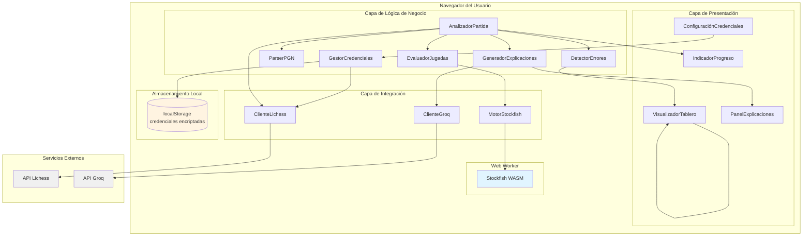
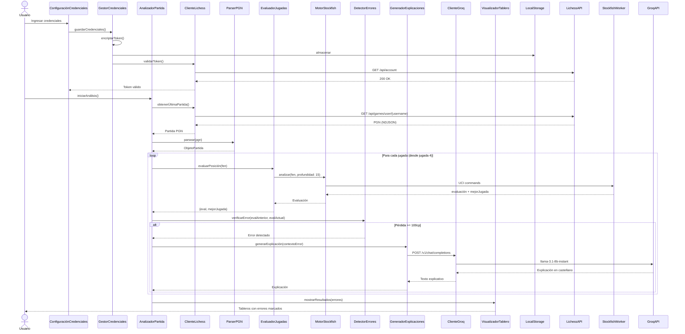
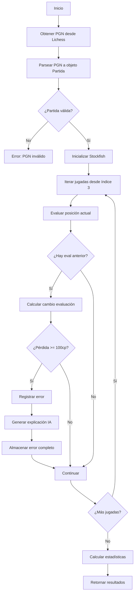
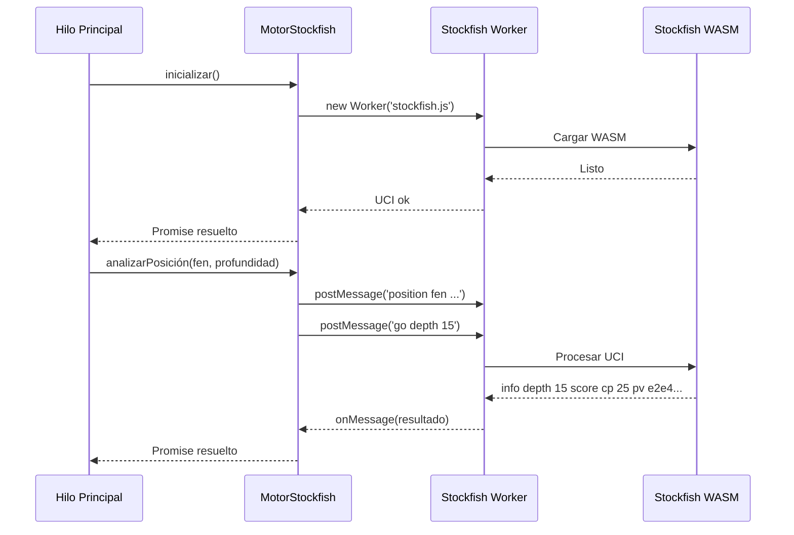

# Documento de Diseño Técnico: Análisis de Partidas de Lichess

## Resumen Ejecutivo

Este documento define el diseño técnico completo para la funcionalidad de análisis automático de partidas de ajedrez desde Lichess. El sistema permite a los usuarios analizar su partida más reciente, identificar errores significativos mediante el motor Stockfish ejecutándose en el navegador, y recibir explicaciones educativas generadas por IA a través de Groq API.

**Tecnologías Principales:**
- React 19.2.7 + TypeScript 6.0.2
- Vite 8.1.1 (build tool)
- chess.js 1.4.0 (motor de ajedrez y parser PGN)
- react-chessboard 5.10.0 (visualización de tableros)
- Stockfish.js (análisis de posiciones en WASM)
- Groq API con llama-3.1-8b-instant (explicaciones IA)
- Fetch API nativa (comunicación con Lichess)

**Principios de Diseño:**
1. **Ejecución en el navegador**: Todo el análisis ocurre localmente usando Stockfish WASM
2. **Sin servidores intermediarios**: Comunicación directa con APIs públicas (Lichess, Groq)
3. **Seguridad de credenciales**: Almacenamiento local encriptado, sin envío a servidores propios
4. **Interfaz responsiva**: Experiencia consistente desde móvil (320px) hasta escritorio (1920px)
5. **Estilo visual Lichess**: Colores, piezas y animaciones siguiendo el estándar de Lichess.org

## 1. Visión General del Sistema


### 1.1 Diagrama de Arquitectura de Alto Nivel




### 1.2 Flujo de Datos Principal




## 2. Arquitectura de Componentes

### 2.1 Capa de Presentación (UI)

#### 2.1.1 ConfiguraciónCredenciales

**Responsabilidad:** Pantalla inicial para configurar credenciales de Lichess y Groq.

**Props:**
```typescript
interface ConfiguraciónCredencialesProps {
  onConfiguraciónCompletada: () => void;
  credencialesExistentes?: Credenciales | null;
}
```

**Estado:**
```typescript
interface EstadoConfiguracion {
  nombreUsuario: string;
  tokenLichess: string;
  apiKeyGroq: string;
  validando: boolean;
  error: string | null;
}
```

**Comportamiento:**
- Muestra formulario con tres campos de entrada
- Proporciona enlaces a páginas de generación de tokens
- Valida que ningún campo esté vacío
- Delega validación de token a `GestorCredenciales`
- Muestra mensajes de éxito/error
- Permite acceso desde menú para actualizar credenciales


#### 2.1.2 VisualizadorTablero

**Responsabilidad:** Renderiza tableros de ajedrez con highlights y navegación.

**Props:**
```typescript
interface VisualizadorTableroProps {
  posiciónFEN: string;
  orientación?: 'white' | 'black';
  movimientoResaltado?: { desde: string; hacia: string };
  tipoResaltado?: 'error' | 'mejorJugada' | 'últimoMovimiento';
  onCambiarPosición?: (numeroPosición: number) => void;
  modo?: 'partida' | 'explicación';
}
```

**Integración con react-chessboard:**
```typescript
<Chessboard
  boardWidth={anchoAdaptativo}
  position={posiciónFEN}
  customDarkSquareStyle={{ backgroundColor: '#b58863' }}
  customLightSquareStyle={{ backgroundColor: '#f0d9b5' }}
  customSquareStyles={generarEstilosResaltado()}
  arePiecesDraggable={false}
  boardOrientation={orientación}
  animationDuration={300}
/>
```

**Características:**
- Colores estilo Lichess (#f0d9b5, #b58863)
- Piezas SVG escalables
- Animaciones suaves (300ms)
- Highlights de contexto (rojo para errores, verde para mejores jugadas)
- Coordenadas siempre visibles
- Responsive (320px - 1920px)
- Navegación jugada por jugada con controles anterior/siguiente


#### 2.1.3 IndicadorProgreso

**Responsabilidad:** Muestra el progreso del análisis en tiempo real.

**Props:**
```typescript
interface IndicadorProgresoProps {
  jugadaActual: number;
  totalJugadas: number;
  tiempoPromedioPorJugada: number;
  erroresEncontrados: number;
  estado: 'analizando' | 'completado' | 'pausado' | 'error';
}
```

**Cálculos:**
- Porcentaje: `(jugadaActual / totalJugadas) * 100`
- Tiempo restante estimado: `(totalJugadas - jugadaActual) * tiempoPromedioPorJugada`
- Visualización de barra de progreso con información contextual

#### 2.1.4 PanelExplicaciones

**Responsabilidad:** Muestra explicaciones de errores generadas por IA.

**Props:**
```typescript
interface PanelExplicacionesProps {
  error: ErrorDetectado;
  explicación: string | null;
  cargando: boolean;
  onProfundizar: () => void;
  onMostrarEnTablero: () => void;
  onVolver: () => void;
}
```

**Características:**
- Muestra explicación concisa (máx 150 palabras)
- Botón "Profundizar explicación" para versión extendida (máx 300 palabras)
- Botón "Mostrar en tablero" abre tablero interactivo con variante
- Fallback a explicación básica si Groq API falla
- Navegación para volver a lista de errores


### 2.2 Capa de Lógica de Negocio

#### 2.2.1 GestorCredenciales

**Responsabilidad:** Gestionar almacenamiento, recuperación, validación y encriptación de credenciales.

**Interfaz Pública:**
```typescript
class GestorCredenciales {
  cargarCredenciales(): Credenciales | null;
  guardarCredenciales(credenciales: Credenciales): void;
  limpiarCredenciales(): void;
  validarToken(token: string, nombreUsuario: string): Promise<ResultadoValidación>;
  verificarExistenciaConfiguracion(): boolean;
}
```

**Implementación de Encriptación:**
```typescript
private encriptarToken(token: string): string {
  // Usar btoa() para codificación Base64 como mínimo
  return btoa(token);
}

private desencriptarToken(tokenEncriptado: string): string {
  // Usar atob() para decodificación
  return atob(tokenEncriptado);
}
```

**Almacenamiento en localStorage:**
```typescript
// Claves de localStorage
const CLAVE_CREDENCIALES = 'ajedrez_trainer_credenciales';

// Estructura almacenada
interface CredencialesAlmacenadas {
  nombreUsuario: string;
  tokenLichessEncriptado: string;
  apiKeyGroqEncriptada: string;
  fechaAlmacenamiento: number;
}
```

**Validación de Token:**
- Realiza petición GET a `/api/account` de Lichess
- Timeout de 5 segundos
- Retorna éxito/error con mensaje descriptivo


#### 2.2.2 AnalizadorPartida

**Responsabilidad:** Orquestador principal del flujo de análisis completo.

**Interfaz Pública:**
```typescript
class AnalizadorPartida {
  async iniciarAnálisis(nombreUsuario: string): Promise<ResultadoAnálisis>;
  pausarAnálisis(): void;
  reanudarAnálisis(): void;
  obtenerProgreso(): ProgresoAnálisis;
}

interface ResultadoAnálisis {
  partida: Partida;
  erroresDetectados: ErrorDetectado[];
  pérdidaPromedioCentipawns: number;
  jugadasAnalizadas: number;
  tiempoTotal: number;
}
```

**Flujo de Ejecución:**


**Gestión de Estado:**
```typescript
interface EstadoAnalizador {
  estado: 'inactivo' | 'analizando' | 'pausado' | 'completado' | 'error';
  jugadaActual: number;
  evaluaciones: Map<number, Evaluación>;
  errores: ErrorDetectado[];
  tiempoInicio: number;
  tiemposPorJugada: number[];
}
```


#### 2.2.3 ParserPGN

**Responsabilidad:** Parsear cadenas PGN en objetos estructurados de partida.

**Interfaz Pública:**
```typescript
class ParserPGN {
  parsear(pgnString: string): Partida;
  serializar(partida: Partida): string; // Para round-trip testing
}

interface Partida {
  metadatos: MetadatosPartida;
  jugadas: Jugada[];
  resultado: '1-0' | '0-1' | '1/2-1/2' | '*';
}

interface MetadatosPartida {
  blancas: string;
  negras: string;
  fecha: string;
  evento: string;
  sitio: string;
  apertura?: string;
  eloBlancas?: number;
  eloNegras?: number;
  controlTiempo?: string;
}

interface Jugada {
  numeroJugada: number;
  turno: 'white' | 'black';
  jugadaSAN: string;
  jugadaUCI?: string;
  comentario?: string;
  anotacion?: string; // !, !!, ?, ??, !?, ?!
  fen?: string; // Posición resultante
}
```

**Implementación:**
- Utiliza `chess.js` para parsing y validación
- Extrae metadatos de encabezados PGN
- Convierte secuencia SAN en lista de objetos `Jugada`
- Genera FEN para cada posición
- Valida sintaxis PGN estándar
- Maneja comentarios y anotaciones

**Manejo de Errores:**
```typescript
class ErrorParseoPGN extends Error {
  constructor(mensaje: string, líneaError?: number) {
    super(`Error parseando PGN${líneaError ? ` en línea ${líneaError}` : ''}: ${mensaje}`);
  }
}
```


#### 2.2.4 EvaluadorJugadas

**Responsabilidad:** Evaluar posiciones de ajedrez usando Stockfish.

**Interfaz Pública:**
```typescript
class EvaluadorJugadas {
  async evaluarPosición(fen: string, profundidad?: number): Promise<Evaluación>;
  async evaluarSecuencia(fens: string[]): Promise<Evaluación[]>;
  establecerProfundidad(profundidad: number): void;
}

interface Evaluación {
  fen: string;
  centipawns: number;
  mate?: number; // Número de jugadas hasta mate (si aplica)
  mejorJugada: string; // En formato UCI (e.g., "e2e4")
  mejorJugadaSAN: string; // En notación SAN (e.g., "e4")
  profundidad: number;
  tiempoEvaluación: number; // millisegundos
}
```

**Configuración:**
- Profundidad por defecto: 15 plies
- Timeout por posición: 2 segundos
- Procesamiento secuencial (una posición a la vez)
- Yields al hilo principal cada 2 segundos

**Conversión de Evaluaciones:**
```typescript
private normalizarEvaluación(infoStockfish: string): number {
  // Formato info UCI: "info depth 15 score cp 25"
  // o "info depth 20 score mate 3"
  
  if (infoStockfish.includes('mate')) {
    const jugadasMate = extraerNumeroMate(infoStockfish);
    return jugadasMate > 0 ? 10000 : -10000; // Mate normalizado
  }
  
  const centipawns = extraerCentipawns(infoStockfish);
  return centipawns;
}
```


#### 2.2.5 DetectorErrores

**Responsabilidad:** Identificar jugadas con pérdida significativa de evaluación.

**Interfaz Pública:**
```typescript
class DetectorErrores {
  detectarError(
    evaluaciónAnterior: Evaluación,
    evaluaciónActual: Evaluación,
    jugada: Jugada,
    numeroJugada: number
  ): ErrorDetectado | null;
  
  filtrarPrimerasTresJugadas(errores: ErrorDetectado[]): ErrorDetectado[];
}

interface ErrorDetectado {
  numeroJugada: number;
  turno: 'white' | 'black';
  fenAntes: string;
  jugadaRealizada: Jugada;
  mejorJugada: string;
  mejorJugadaSAN: string;
  evaluaciónAntes: number;
  evaluaciónDespués: number;
  pérdidaCentipawns: number;
  variante?: string[]; // Secuencia de jugadas de la mejor línea
}
```

**Lógica de Detección:**
```typescript
detectarError(evalAntes: Evaluación, evalDespués: Evaluación, jugada: Jugada, num: number): ErrorDetectado | null {
  // Ignorar primeras 3 jugadas (teoría de apertura)
  if (num <= 3) return null;
  
  // Calcular cambio desde perspectiva del jugador
  const cambio = jugada.turno === 'white' 
    ? evalDespués.centipawns - evalAntes.centipawns  // Blancas: positivo es bueno
    : evalAntes.centipawns - evalDespués.centipawns; // Negras: negativo es bueno (invertimos)
  
  // Error significativo: pérdida >= 100cp
  const UMBRAL_ERROR = 100;
  if (cambio < -UMBRAL_ERROR) {
    return {
      numeroJugada: num,
      turno: jugada.turno,
      fenAntes: evalAntes.fen,
      jugadaRealizada: jugada,
      mejorJugada: evalAntes.mejorJugada, // La mejor jugada era antes de jugar
      mejorJugadaSAN: evalAntes.mejorJugadaSAN,
      evaluaciónAntes: evalAntes.centipawns,
      evaluaciónDespués: evalDespués.centipawns,
      pérdidaCentipawns: Math.abs(cambio)
    };
  }
  
  return null;
}
```


#### 2.2.6 GeneradorExplicaciones

**Responsabilidad:** Generar explicaciones educativas usando Groq API.

**Interfaz Pública:**
```typescript
class GeneradorExplicaciones {
  async generarExplicaciónConcisa(error: ErrorDetectado): Promise<string>;
  async generarExplicaciónExtendida(error: ErrorDetectado): Promise<string>;
  generarExplicaciónBásica(error: ErrorDetectado): string; // Fallback sin IA
}
```

**Integración con Groq API:**
```typescript
async generarExplicaciónConcisa(error: ErrorDetectado): Promise<string> {
  const prompt = construirPromptConciso(error);
  
  try {
    const respuesta = await this.clienteGroq.chatCompletion({
      modelo: 'llama-3.1-8b-instant',
      mensajes: [
        {
          rol: 'system',
          contenido: PROMPT_SISTEMA_EXPLICACIONES
        },
        {
          rol: 'user',
          contenido: prompt
        }
      ],
      longitudMáxima: 150, // palabras
      temperatura: 0.7
    });
    
    return respuesta.choices[0].message.content;
  } catch (error) {
    console.error('Error llamando a Groq API:', error);
    return this.generarExplicaciónBásica(error);
  }
}
```

**Prompt del Sistema (castellano):**
```typescript
const PROMPT_SISTEMA_EXPLICACIONES = `Eres un entrenador de ajedrez educativo y amigable.
Tu tarea es explicar errores en partidas de ajedrez en castellano, de forma clara y concisa.

Para cada error, debes explicar:
1. Qué jugada se realizó
2. Por qué fue un error (consecuencias tácticas/posicionales)
3. Qué se debió jugar en su lugar
4. Qué amenazas o tácticas se pasaron por alto

Usa terminología de ajedrez en español. Mantén un tono educativo y motivador.
Sé conciso pero completo.`;
```

**Construcción del Prompt:**
```typescript
function construirPromptConciso(error: ErrorDetectado): string {
  return `Analiza este error de ajedrez:

Posición (FEN): ${error.fenAntes}
Turno: ${error.turno === 'white' ? 'Blancas' : 'Negras'}
Jugada realizada: ${error.jugadaRealizada.jugadaSAN}
Mejor jugada alternativa: ${error.mejorJugadaSAN}
Pérdida de evaluación: ${error.pérdidaCentipawns} centipawns

Proporciona una explicación educativa en máximo 150 palabras.`;
}
```

**Explicación Básica (Fallback):**
```typescript
generarExplicaciónBásica(error: ErrorDetectado): string {
  const turnoStr = error.turno === 'white' ? 'Blancas' : 'Negras';
  return `Jugada ${error.numeroJugada}: ${turnoStr} jugó ${error.jugadaRealizada.jugadaSAN}, 
  perdiendo ${error.pérdidaCentipawns} centipawns. 
  La mejor jugada era ${error.mejorJugadaSAN}. 
  Esta jugada empeoró significativamente la posición.`;
}
```


### 2.3 Capa de Integración

#### 2.3.1 ClienteLichess

**Responsabilidad:** Comunicación con la API pública de Lichess usando Fetch API nativa.

**Interfaz Pública:**
```typescript
class ClienteLichess {
  constructor(token: string);
  
  async validarToken(): Promise<boolean>;
  async obtenerCuentaUsuario(): Promise<CuentaLichess>;
  async obtenerÚltimaPartida(nombreUsuario: string): Promise<string>; // Retorna PGN
}

interface CuentaLichess {
  id: string;
  username: string;
  perfs: Record<string, { rating: number }>;
  createdAt: number;
}
```

**Endpoints Utilizados:**
```typescript
const LICHESS_BASE_URL = 'https://lichess.org';

const ENDPOINTS = {
  cuenta: '/api/account',
  partidasUsuario: (username: string) => `/api/games/user/${username}`,
};
```

**Implementación de obtenerÚltimaPartida:**
```typescript
async obtenerÚltimaPartida(nombreUsuario: string): Promise<string> {
  const url = `${LICHESS_BASE_URL}${ENDPOINTS.partidasUsuario(nombreUsuario)}`;
  
  const respuesta = await fetch(url, {
    method: 'GET',
    headers: {
      'Authorization': `Bearer ${this.token}`,
      'Accept': 'application/x-ndjson' // NDJSON format
    },
    signal: AbortSignal.timeout(10000) // 10 segundos timeout
  });
  
  if (!respuesta.ok) {
    if (respuesta.status === 404) {
      throw new Error('Nombre de usuario no encontrado');
    }
    if (respuesta.status === 401) {
      throw new Error('Token de API inválido o expirado');
    }
    throw new Error(`Error de API de Lichess: ${respuesta.status}`);
  }
  
  const textoCompleto = await respuesta.text();
  
  // NDJSON: cada línea es un JSON de partida
  const líneas = textoCompleto.trim().split('\n');
  
  if (líneas.length === 0) {
    throw new Error('No se encontraron partidas para este usuario');
  }
  
  // Primera línea es la partida más reciente
  const partidaJSON = JSON.parse(líneas[0]);
  return partidaJSON.pgn;
}
```


#### 2.3.2 ClienteGroq

**Responsabilidad:** Comunicación con la API de Groq para generación de texto.

**Interfaz Pública:**
```typescript
class ClienteGroq {
  constructor(apiKey: string);
  
  async chatCompletion(parámetros: ParámetrosChatCompletion): Promise<RespuestaGroq>;
}

interface ParámetrosChatCompletion {
  modelo: string;
  mensajes: Mensaje[];
  longitudMáxima?: number;
  temperatura?: number;
}

interface Mensaje {
  rol: 'system' | 'user' | 'assistant';
  contenido: string;
}

interface RespuestaGroq {
  id: string;
  choices: Array<{
    message: {
      role: string;
      content: string;
    };
    finish_reason: string;
  }>;
  usage: {
    prompt_tokens: number;
    completion_tokens: number;
    total_tokens: number;
  };
}
```

**Implementación:**
```typescript
async chatCompletion(parámetros: ParámetrosChatCompletion): Promise<RespuestaGroq> {
  const url = 'https://api.groq.com/openai/v1/chat/completions';
  
  const respuesta = await fetch(url, {
    method: 'POST',
    headers: {
      'Authorization': `Bearer ${this.apiKey}`,
      'Content-Type': 'application/json'
    },
    body: JSON.stringify({
      model: parámetros.modelo,
      messages: parámetros.mensajes,
      max_tokens: parámetros.longitudMáxima || 500,
      temperature: parámetros.temperatura || 0.7
    })
  });
  
  if (!respuesta.ok) {
    const errorData = await respuesta.json().catch(() => ({}));
    throw new Error(`Error de Groq API: ${respuesta.status} - ${errorData.error?.message || 'Error desconocido'}`);
  }
  
  return respuesta.json();
}
```


#### 2.3.3 MotorStockfish

**Responsabilidad:** Wrapper para Stockfish.js con soporte de Web Workers.

**Interfaz Pública:**
```typescript
class MotorStockfish {
  async inicializar(): Promise<void>;
  async analizarPosición(fen: string, profundidad: number): Promise<ResultadoAnálisis>;
  detener(): void;
}

interface ResultadoAnálisis {
  mejorJugada: string; // UCI format
  evaluación: number; // centipawns
  mate?: number;
  profundidad: number;
  nodos: number;
  tiempo: number;
}
```

**Arquitectura con Web Worker:**


**Implementación:**
```typescript
class MotorStockfish {
  private worker: Worker | null = null;
  private promesaActual: {
    resolve: (resultado: ResultadoAnálisis) => void;
    reject: (error: Error) => void;
  } | null = null;
  
  async inicializar(): Promise<void> {
    return new Promise((resolve, reject) => {
      this.worker = new Worker('/stockfish.js'); // Path a Stockfish WASM
      
      this.worker.onmessage = (evento) => {
        if (evento.data === 'uciok') {
          this.worker!.postMessage('uci');
        } else if (evento.data === 'readyok') {
          resolve();
        }
      };
      
      this.worker.onerror = (error) => reject(error);
      
      setTimeout(() => reject(new Error('Timeout inicializando Stockfish')), 5000);
    });
  }
  
  async analizarPosición(fen: string, profundidad: number): Promise<ResultadoAnálisis> {
    if (!this.worker) throw new Error('Stockfish no inicializado');
    
    return new Promise((resolve, reject) => {
      this.promesaActual = { resolve, reject };
      
      let mejorJugada: string | null = null;
      let evaluación: number | null = null;
      
      this.worker!.onmessage = (evento) => {
        const línea = evento.data;
        
        // Parsear info de evaluación
        if (línea.startsWith('info') && línea.includes('score')) {
          evaluación = this.extraerEvaluación(línea);
        }
        
        // Mejor jugada
        if (línea.startsWith('bestmove')) {
          mejorJugada = línea.split(' ')[1];
          
          if (mejorJugada && evaluación !== null) {
            this.promesaActual!.resolve({
              mejorJugada,
              evaluación,
              profundidad
            });
          }
        }
      };
      
      this.worker!.postMessage(`position fen ${fen}`);
      this.worker!.postMessage(`go depth ${profundidad}`);
      
      // Timeout de 2 segundos por posición
      setTimeout(() => {
        if (this.promesaActual) {
          this.worker!.postMessage('stop');
          reject(new Error('Timeout analizando posición'));
        }
      }, 2000);
    });
  }
  
  private extraerEvaluación(líneaInfo: string): number {
    // "info depth 15 score cp 25" -> 25
    // "info depth 20 score mate 3" -> 10000 (mate en 3)
    
    if (líneaInfo.includes('mate')) {
      const match = líneaInfo.match(/mate (-?\d+)/);
      const jugadasMate = match ? parseInt(match[1]) : 0;
      return jugadasMate > 0 ? 10000 : -10000;
    }
    
    const match = líneaInfo.match(/score cp (-?\d+)/);
    return match ? parseInt(match[1]) : 0;
  }
}
```


## 3. Modelos de Datos

### 3.1 Tipos TypeScript Principales

```typescript
// ============ Credenciales ============
interface Credenciales {
  nombreUsuario: string;
  tokenLichess: string;
  apiKeyGroq: string;
}

interface CredencialesAlmacenadas {
  nombreUsuario: string;
  tokenLichessEncriptado: string;
  apiKeyGroqEncriptada: string;
  fechaAlmacenamiento: number;
}

interface ResultadoValidación {
  válido: boolean;
  error?: string;
}

// ============ Partida de Ajedrez ============
interface Partida {
  metadatos: MetadatosPartida;
  jugadas: Jugada[];
  resultado: '1-0' | '0-1' | '1/2-1/2' | '*';
}

interface MetadatosPartida {
  blancas: string;
  negras: string;
  fecha: string;
  evento: string;
  sitio: string;
  apertura?: string;
  eloBlancas?: number;
  eloNegras?: number;
  controlTiempo?: string;
}

interface Jugada {
  numeroJugada: number;
  turno: 'white' | 'black';
  jugadaSAN: string;  // e.g., "Nf3"
  jugadaUCI?: string; // e.g., "g1f3"
  comentario?: string;
  anotacion?: '!' | '!!' | '?' | '??' | '!?' | '?!';
  fen?: string;
}

// ============ Evaluación ============
interface Evaluación {
  fen: string;
  centipawns: number;
  mate?: number;
  mejorJugada: string;      // UCI format
  mejorJugadaSAN: string;   // SAN format
  profundidad: number;
  tiempoEvaluación: number;
}

// ============ Error Detectado ============
interface ErrorDetectado {
  numeroJugada: number;
  turno: 'white' | 'black';
  fenAntes: string;
  jugadaRealizada: Jugada;
  mejorJugada: string;
  mejorJugadaSAN: string;
  evaluaciónAntes: number;
  evaluaciónDespués: number;
  pérdidaCentipawns: number;
  variante?: string[];
  explicación?: string;
  explicaciónExtendida?: string;
}

// ============ Resultado de Análisis ============
interface ResultadoAnálisis {
  partida: Partida;
  erroresDetectados: ErrorDetectado[];
  pérdidaPromedioCentipawns: number;
  jugadasAnalizadas: number;
  tiempoTotal: number;
  estadísticas: EstadísticasAnálisis;
}

interface EstadísticasAnálisis {
  totalJugadas: number;
  erroresBlancas: number;
  erroresNegras: number;
  mayorPérdida: number;
  jugadaMayorPérdida: number;
  rendimientoGeneral: 'excelente' | 'sólido' | 'aceptable' | 'mejorable';
}

// ============ Progreso ============
interface ProgresoAnálisis {
  estado: 'inactivo' | 'analizando' | 'pausado' | 'completado' | 'error';
  jugadaActual: number;
  totalJugadas: number;
  erroresEncontrados: number;
  tiempoPromedioPorJugada: number;
  tiempoRestanteEstimado: number;
}
```


## 4. Flujo de Usuario

### 4.1 Diagrama de Flujo Completo

```mermaid
flowchart TD
    Start([Usuario inicia aplicación]) --> CheckConfig{¿Credenciales<br/>configuradas?}
    
    CheckConfig -->|No| ShowConfigScreen[Mostrar pantalla<br/>de configuración]
    ShowConfigScreen --> InputCreds[Usuario ingresa:<br/>- Username Lichess<br/>- Token Lichess<br/>- API Key Groq]
    InputCreds --> ValidateInput{¿Campos válidos?}
    ValidateInput -->|No| ShowError1[Mostrar error:<br/>campos vacíos]
    ShowError1 --> InputCreds
    ValidateInput -->|Sí| ValidateToken[Validar token<br/>con Lichess API]
    ValidateToken --> TokenValid{¿Token válido?}
    TokenValid -->|No| ShowError2[Mostrar error:<br/>token inválido]
    ShowError2 --> InputCreds
    TokenValid -->|Sí| SaveCreds[Guardar credenciales<br/>encriptadas en localStorage]
    SaveCreds --> MainScreen
    
    CheckConfig -->|Sí| MainScreen[Pantalla principal]
    MainScreen --> UserClickAnalyze[Usuario hace clic<br/>en Analizar]
    UserClickAnalyze --> FetchGame[Obtener última partida<br/>desde Lichess]
    
    FetchGame --> GameFetched{¿Partida<br/>obtenida?}
    GameFetched -->|No| ShowError3[Mostrar error<br/>específico]
    ShowError3 --> MainScreen
    
    GameFetched -->|Sí| ParsePGN[Parsear PGN]
    ParsePGN --> PGNValid{¿PGN válido?}
    PGNValid -->|No| ShowError4[Error: PGN inválido]
    ShowError4 --> MainScreen
    
    PGNValid -->|Sí| InitStockfish[Inicializar Stockfish]
    InitStockfish --> StockfishReady{¿Stockfish listo?}
    StockfishReady -->|No| ShowError5[Error: Fallo carga motor]
    ShowError5 --> MainScreen
    
    StockfishReady -->|Sí| AnalyzeLoop[Iniciar análisis<br/>jugada por jugada]
    AnalyzeLoop --> ShowProgress[Mostrar barra de progreso]
    
    ShowProgress --> AnalyzeMove[Analizar jugada N<br/>con Stockfish]
    AnalyzeMove --> CheckError{¿Pérdida<br/>≥ 100cp?}
    
    CheckError -->|Sí| RecordError[Registrar error]
    RecordError --> GenerateExplanation[Generar explicación<br/>con Groq API]
    GenerateExplanation --> ExplanationReady{¿Groq<br/>respondió?}
    ExplanationReady -->|No| UseFallback[Usar explicación<br/>básica]
    ExplanationReady -->|Sí| StoreExplanation[Almacenar explicación]
    UseFallback --> NextMove
    StoreExplanation --> NextMove
    
    CheckError -->|No| NextMove{¿Más jugadas?}
    NextMove -->|Sí| AnalyzeMove
    NextMove -->|No| CalculateStats[Calcular estadísticas]
    
    CalculateStats --> ShowResults{¿Errores<br/>encontrados?}
    ShowResults -->|No| ShowCleanGame[Mostrar mensaje:<br/>Partida sin errores<br/>+ estadísticas]
    ShowResults -->|Sí| DisplayErrors[Mostrar tableros duales<br/>con errores marcados]
    
    ShowCleanGame --> AllowReplay[Permitir navegación<br/>jugada por jugada]
    DisplayErrors --> AllowReplay
    
    AllowReplay --> UserInteract{Usuario<br/>interactúa}
    UserInteract -->|Navegar jugadas| UpdateBoards[Actualizar tableros]
    UpdateBoards --> UserInteract
    
    UserInteract -->|Ver explicación| ShowExplanation[Mostrar panel<br/>de explicación]
    ShowExplanation --> UserReadExpl{Usuario lee<br/>explicación}
    UserReadExpl -->|Profundizar| RequestExtended[Solicitar explicación<br/>extendida a Groq]
    RequestExtended --> ShowExtended[Mostrar explicación<br/>detallada]
    ShowExtended --> UserReadExpl
    
    UserReadExpl -->|Mostrar en tablero| OpenVariantBoard[Abrir tablero<br/>con variante]
    OpenVariantBoard --> UserReadExpl
    
    UserReadExpl -->|Volver| DisplayErrors
    
    UserInteract -->|Configurar credenciales| ShowConfigScreen
    UserInteract -->|Nuevo análisis| MainScreen
    UserInteract -->|Finalizar| End([Fin])
```




## 5. Integraciones Externas

### 5.1 Lichess API

**Documentación:** https://lichess.org/api

#### 5.1.1 Generación de Token

El usuario debe generar un Personal API Token en: https://lichess.org/account/oauth/token

**Scopes requeridos:**
- `game:read` - Para acceder a partidas (incluyendo privadas)

#### 5.1.2 Endpoint: Obtener Partidas del Usuario

```
GET https://lichess.org/api/games/user/{username}
```

**Headers:**
```
Authorization: Bearer {token}
Accept: application/x-ndjson
```

**Query Parameters opcionales:**
```
max=1           # Solo la partida más reciente
pgnInJson=true  # Incluir PGN en el JSON
```

**Formato de Respuesta:** NDJSON (Newline Delimited JSON)
- Cada línea es un objeto JSON representando una partida
- Primera línea es la partida más reciente

**Ejemplo de respuesta (una línea):**
```json
{
  "id": "q7ZvsdUF",
  "rated": true,
  "variant": "standard",
  "speed": "blitz",
  "perf": "blitz",
  "createdAt": 1514505150384,
  "lastMoveAt": 1514505592843,
  "status": "resign",
  "players": {
    "white": {
      "user": { "name": "Usuario1", "id": "usuario1" },
      "rating": 1500
    },
    "black": {
      "user": { "name": "Usuario2", "id": "usuario2" },
      "rating": 1520
    }
  },
  "pgn": "1. e4 e5 2. Nf3 Nc6 3. Bb5 a6..."
}
```

#### 5.1.3 Endpoint: Validar Token

```
GET https://lichess.org/api/account
```

**Headers:**
```
Authorization: Bearer {token}
```

**Respuesta exitosa (200):**
```json
{
  "id": "usuario123",
  "username": "Usuario123",
  "perfs": {
    "blitz": { "rating": 1500, "games": 120 }
  },
  "createdAt": 1290415680000
}
```

**Respuesta error (401):**
Token inválido o expirado

#### 5.1.4 Manejo de Errores

| Código | Significado | Acción |
|--------|-------------|--------|
| 200 | Éxito | Procesar datos |
| 401 | Token inválido/expirado | Solicitar nueva configuración |
| 404 | Usuario no existe | Mostrar error específico |
| 429 | Rate limit excedido | Reintentar después de 1 minuto |
| 5xx | Error de servidor | Mostrar error de red |


### 5.2 Groq API

**Documentación:** https://console.groq.com/docs/quickstart

#### 5.2.1 Generación de API Key

El usuario debe generar una API Key en: https://console.groq.com/keys

#### 5.2.2 Endpoint: Chat Completions

```
POST https://api.groq.com/openai/v1/chat/completions
```

**Headers:**
```
Authorization: Bearer {api_key}
Content-Type: application/json
```

**Body:**
```json
{
  "model": "llama-3.1-8b-instant",
  "messages": [
    {
      "role": "system",
      "content": "Eres un entrenador de ajedrez educativo..."
    },
    {
      "role": "user",
      "content": "Analiza este error de ajedrez..."
    }
  ],
  "max_tokens": 500,
  "temperature": 0.7
}
```

**Respuesta exitosa (200):**
```json
{
  "id": "chatcmpl-123",
  "object": "chat.completion",
  "created": 1677652288,
  "model": "llama-3.1-8b-instant",
  "choices": [
    {
      "index": 0,
      "message": {
        "role": "assistant",
        "content": "En la jugada 12, las blancas jugaron Qd2..."
      },
      "finish_reason": "stop"
    }
  ],
  "usage": {
    "prompt_tokens": 120,
    "completion_tokens": 150,
    "total_tokens": 270
  }
}
```

#### 5.2.3 Modelos Disponibles

| Modelo | Velocidad | Tokens | Uso |
|--------|-----------|--------|-----|
| llama-3.1-8b-instant | Muy rápida | 8k | Explicaciones concisas ✓ |
| llama-3.1-70b-versatile | Media | 32k | Explicaciones extendidas |
| mixtral-8x7b-32768 | Rápida | 32k | Alternativa |

**Modelo seleccionado:** `llama-3.1-8b-instant`
- Balance óptimo entre velocidad y calidad
- Suficiente para explicaciones de ajedrez
- Bajo costo por token

#### 5.2.4 Parámetros de Generación

```typescript
const PARÁMETROS_GROQ = {
  temperatura: 0.7,        // Balance creatividad/precisión
  maxTokensConciso: 500,   // ~150 palabras
  maxTokensExtendido: 1000 // ~300 palabras
};
```

#### 5.2.5 Manejo de Errores

| Código | Significado | Acción |
|--------|-------------|--------|
| 200 | Éxito | Usar explicación generada |
| 401 | API Key inválida | Advertir y usar fallback |
| 429 | Rate limit | Reintentar o usar fallback |
| 500 | Error servidor | Usar explicación básica |
| timeout | Sin respuesta | Usar explicación básica |


### 5.3 Stockfish.js

**Repositorio:** https://github.com/nmrugg/stockfish.js

#### 5.3.1 Instalación y Carga

```typescript
// Opción 1: CDN
<script src="https://cdn.jsdelivr.net/npm/stockfish.js@11/stockfish.js"></script>

// Opción 2: NPM (recomendado)
npm install stockfish.js

// En código:
const worker = new Worker('/node_modules/stockfish.js/stockfish.js');
```

#### 5.3.2 Protocolo UCI (Universal Chess Interface)

**Comandos principales:**

```typescript
// Inicialización
worker.postMessage('uci');        // Respuesta: 'uciok'
worker.postMessage('isready');    // Respuesta: 'readyok'

// Configurar posición
worker.postMessage('position fen rnbqkbnr/pppppppp/8/8/8/8/PPPPPPPP/RNBQKBNR w KQkq - 0 1');

// Analizar a profundidad específica
worker.postMessage('go depth 15');

// Respuestas:
// info depth 15 score cp 25 nodes 1234567 pv e2e4 e7e5 ...
// bestmove e2e4

// Detener análisis
worker.postMessage('stop');

// Nuevo análisis
worker.postMessage('ucinewgame');
```

#### 5.3.3 Interpretación de Output UCI

**Formato info:**
```
info depth 15 score cp 25 nodes 1234567 time 1500 pv e2e4 e7e5 Nf3
```

| Campo | Significado |
|-------|-------------|
| depth | Profundidad de búsqueda (plies) |
| score cp | Evaluación en centipawns |
| score mate | Mate en N jugadas |
| nodes | Nodos analizados |
| time | Tiempo en milisegundos |
| pv | Principal Variation (mejor línea) |

**Formato bestmove:**
```
bestmove e2e4 ponder e7e5
```

- `e2e4` - Mejor jugada en notación UCI
- `ponder` - Jugada anticipada del oponente (opcional)

#### 5.3.4 Web Worker Setup

```typescript
// stockfish-worker.ts
let stockfish: Worker | null = null;

self.onmessage = (event) => {
  if (event.data.type === 'init') {
    // Cargar Stockfish WASM
    importScripts('/stockfish.js');
    stockfish = new Worker('/stockfish.wasm.js');
    
    stockfish.onmessage = (msg) => {
      self.postMessage({ type: 'stockfish', data: msg.data });
    };
    
    self.postMessage({ type: 'ready' });
  } else if (event.data.type === 'command') {
    stockfish?.postMessage(event.data.command);
  }
};
```

#### 5.3.5 Configuración de Rendimiento

```typescript
// Configurar Stockfish para análisis rápido
worker.postMessage('setoption name Threads value 2');
worker.postMessage('setoption name Hash value 128'); // MB
worker.postMessage('setoption name MultiPV value 1'); // Solo mejor jugada
```

**Parámetros recomendados:**
- **Threads:** 2 (máximo para navegador)
- **Hash:** 128 MB (balance memoria/rendimiento)
- **MultiPV:** 1 (solo primera mejor jugada)
- **Depth:** 15 plies (~2 segundos por posición)


## 6. Consideraciones de Rendimiento

### 6.1 Web Workers para Análisis No Bloqueante

**Problema:** Stockfish es computacionalmente intensivo y puede bloquear el hilo principal de JavaScript.

**Solución:** Ejecutar Stockfish en Web Worker dedicado.

```mermaid
flowchart LR
    subgraph "Hilo Principal"
        UI[UI Components]
        Evaluador[EvaluadorJugadas]
    end
    
    subgraph "Web Worker"
        Wrapper[Stockfish Wrapper]
        WASM[Stockfish WASM]
    end
    
    UI <--> Evaluador
    Evaluador <--> Wrapper
    Wrapper <--> WASM
    
    style "Web Worker" fill:#e1f5ff
```

**Beneficios:**
- UI permanece responsiva durante análisis
- Múltiples posiciones pueden analizarse sin lag
- Animaciones y navegación funcionan mientras se analiza

### 6.2 Evaluación Secuencial con Yields

**Estrategia:** Analizar una posición a la vez, cediendo control al hilo principal periódicamente.

```typescript
async function analizarPartidaSecuencial(jugadas: Jugada[]): Promise<Evaluación[]> {
  const evaluaciones: Evaluación[] = [];
  let tiempoÚltimoYield = Date.now();
  
  for (let i = 0; i < jugadas.length; i++) {
    // Analizar posición
    const eval = await evaluarPosición(jugadas[i].fen);
    evaluaciones.push(eval);
    
    // Yield cada 2 segundos
    if (Date.now() - tiempoÚltimoYield > 2000) {
      await new Promise(resolve => setTimeout(resolve, 0));
      tiempoÚltimoYield = Date.now();
    }
    
    // Actualizar progreso
    notificarProgreso(i + 1, jugadas.length);
  }
  
  return evaluaciones;
}
```

### 6.3 Lazy Loading de Stockfish WASM

**Problema:** Stockfish WASM es ~2-5 MB, impacta tiempo de carga inicial.

**Solución:** Cargar Stockfish solo cuando el usuario inicia análisis.

```typescript
class AnalizadorPartida {
  private stockfishCargado = false;
  
  async iniciarAnálisis() {
    if (!this.stockfishCargado) {
      mostrarMensaje('Cargando motor de análisis...');
      await this.motorStockfish.inicializar();
      this.stockfishCargado = true;
    }
    
    // Continuar con análisis...
  }
}
```

### 6.4 Caché de Evaluaciones

**Optimización:** Cachear evaluaciones de posiciones para evitar re-análisis.

```typescript
class CachéEvaluaciones {
  private caché = new Map<string, Evaluación>();
  
  obtener(fen: string): Evaluación | undefined {
    return this.caché.get(fen);
  }
  
  almacenar(fen: string, evaluación: Evaluación): void {
    // Limitar tamaño del caché a 1000 posiciones
    if (this.caché.size > 1000) {
      const primeraClave = this.caché.keys().next().value;
      this.caché.delete(primeraClave);
    }
    
    this.caché.set(fen, evaluación);
  }
}
```

**Uso:**
```typescript
async evaluarPosición(fen: string): Promise<Evaluación> {
  const cacheada = this.caché.obtener(fen);
  if (cacheada) return cacheada;
  
  const evaluación = await this.motorStockfish.analizarPosición(fen);
  this.caché.almacenar(fen, evaluación);
  
  return evaluación;
}
```

### 6.5 Límites y Timeouts

| Operación | Límite | Razón |
|-----------|--------|-------|
| Inicialización Stockfish | 5s | Prevenir hang infinito |
| Evaluación por posición | 2s | Balance calidad/velocidad |
| Petición Lichess API | 10s | Red lenta/timeout |
| Petición Groq API | 15s | Generación IA puede ser lenta |
| Análisis completo (40 jugadas) | ~80s | 2s por jugada |

### 6.6 Estimación de Tiempo

```typescript
function estimarTiempoRestante(
  jugadaActual: number,
  totalJugadas: number,
  tiemposPrevios: number[]
): number {
  // Calcular tiempo promedio de las últimas 5 jugadas
  const últimasCinco = tiemposPrevios.slice(-5);
  const promedio = últimasCinco.reduce((a, b) => a + b, 0) / últimasCinco.length;
  
  const jugadasRestantes = totalJugadas - jugadaActual;
  return jugadasRestantes * promedio;
}
```


## 7. Seguridad

### 7.1 Almacenamiento de Credenciales

#### 7.1.1 Encriptación de Tokens

**Requisito:** Los tokens de API deben almacenarse encriptados en localStorage.

**Implementación Mínima (Base64):**
```typescript
function encriptarToken(token: string): string {
  return btoa(token); // Base64 encoding
}

function desencriptarToken(tokenEncriptado: string): string {
  return atob(tokenEncriptado); // Base64 decoding
}
```

**Nota de Seguridad:** 
- `btoa()` NO es encriptación real, solo codificación
- Previene lectura casual pero NO protege contra acceso malicioso
- Para producción, considerar Web Crypto API para encriptación real

**Implementación Mejorada (Web Crypto API - opcional):**
```typescript
async function encriptarTokenSeguro(token: string, contraseña: string): Promise<string> {
  const encoder = new TextEncoder();
  const data = encoder.encode(token);
  
  // Derivar clave desde contraseña
  const keyMaterial = await window.crypto.subtle.importKey(
    'raw',
    encoder.encode(contraseña),
    'PBKDF2',
    false,
    ['deriveBits', 'deriveKey']
  );
  
  const key = await window.crypto.subtle.deriveKey(
    {
      name: 'PBKDF2',
      salt: encoder.encode('ajedrez-trainer-salt'),
      iterations: 100000,
      hash: 'SHA-256'
    },
    keyMaterial,
    { name: 'AES-GCM', length: 256 },
    false,
    ['encrypt', 'decrypt']
  );
  
  const iv = window.crypto.getRandomValues(new Uint8Array(12));
  const encrypted = await window.crypto.subtle.encrypt(
    { name: 'AES-GCM', iv },
    key,
    data
  );
  
  // Combinar IV + datos encriptados
  return btoa(String.fromCharCode(...iv, ...new Uint8Array(encrypted)));
}
```

#### 7.1.2 Estructura de Almacenamiento

```typescript
interface CredencialesAlmacenadas {
  version: number; // Para futuras migraciones
  nombreUsuario: string; // Texto plano (no es sensible)
  tokenLichessEncriptado: string;
  apiKeyGroqEncriptada: string;
  fechaAlmacenamiento: number;
}

const CLAVE_STORAGE = 'ajedrez_trainer_credenciales_v1';
```

### 7.2 Principios de Privacidad

#### 7.2.1 No Envío a Servidores Propios

**Regla Crítica:** Las credenciales NUNCA deben enviarse a servidores controlados por nosotros.

```typescript
// ✅ CORRECTO: Comunicación directa
async function obtenerPartida(usuario: string, token: string) {
  return fetch('https://lichess.org/api/games/user/' + usuario, {
    headers: { 'Authorization': `Bearer ${token}` }
  });
}

// ❌ INCORRECTO: Enviar a nuestro servidor
async function obtenerPartida(usuario: string, token: string) {
  return fetch('https://nuestro-servidor.com/proxy/lichess', {
    headers: { 'X-User-Token': token } // ¡NO HACER ESTO!
  });
}
```

#### 7.2.2 Alcance de Credenciales

| Credencial | Usado Por | Enviado A |
|------------|-----------|-----------|
| Token Lichess | ClienteLichess | lichess.org únicamente |
| API Key Groq | ClienteGroq | api.groq.com únicamente |
| Ninguno | - | Ningún servidor propio |

### 7.3 Validación de Entrada

#### 7.3.1 Validación de Credenciales

```typescript
function validarCredenciales(creds: Credenciales): ResultadoValidación {
  // Campos no vacíos
  if (!creds.nombreUsuario?.trim()) {
    return { válido: false, error: 'Nombre de usuario requerido' };
  }
  
  if (!creds.tokenLichess?.trim()) {
    return { válido: false, error: 'Token de Lichess requerido' };
  }
  
  if (!creds.apiKeyGroq?.trim()) {
    return { válido: false, error: 'API Key de Groq requerida' };
  }
  
  // Formato de username (alfanumérico, guiones, guiones bajos)
  if (!/^[a-zA-Z0-9_-]+$/.test(creds.nombreUsuario)) {
    return { válido: false, error: 'Nombre de usuario inválido' };
  }
  
  // Token Lichess típicamente empieza con "lip_"
  if (!creds.tokenLichess.startsWith('lip_')) {
    return { 
      válido: false, 
      error: 'Token de Lichess parece inválido (debe empezar con "lip_")' 
    };
  }
  
  return { válido: true };
}
```

#### 7.3.2 Sanitización de PGN

```typescript
function sanitizarPGN(pgn: string): string {
  // Remover caracteres de control potencialmente peligrosos
  return pgn
    .replace(/[\x00-\x08\x0B\x0C\x0E-\x1F\x7F]/g, '')
    .trim();
}
```

### 7.4 Content Security Policy (CSP)

**Configuración recomendada en `index.html`:**
```html
<meta http-equiv="Content-Security-Policy" content="
  default-src 'self';
  script-src 'self' 'wasm-unsafe-eval';
  worker-src 'self' blob:;
  connect-src 'self' https://lichess.org https://api.groq.com;
  img-src 'self' data:;
  style-src 'self' 'unsafe-inline';
">
```

**Explicación:**
- `script-src 'wasm-unsafe-eval'`: Permite Stockfish WASM
- `worker-src blob:`: Permite Web Workers
- `connect-src`: Limita peticiones de red solo a Lichess y Groq
- `style-src 'unsafe-inline'`: Permite estilos inline de react-chessboard

### 7.5 Verificación de Seguridad con Hook

**Uso del hook .kiro/hooks/security-check.kiro:**
- Verificar que no se exponen credenciales en el código
- Validar que no hay endpoints propios recibiendo credenciales
- Confirmar uso correcto de encriptación


## 8. Estilo Visual

### 8.1 Referencia al Steering de Estilo

**Documento principal:** `.kiro/steering/estilo-visual-tablero.md`

Todos los tableros de ajedrez DEBEN seguir el estilo visual de Lichess definido en el documento de steering.

### 8.2 Especificaciones de Tablero

#### 8.2.1 Configuración de react-chessboard

```typescript
import { Chessboard } from 'react-chessboard';

function TableroEstiloLichess({ fen, highlights }: TableroProps) {
  return (
    <Chessboard
      // Posición
      position={fen}
      boardOrientation="white"
      
      // Tamaño responsive
      boardWidth={calcularAnchoAdaptativo()}
      
      // Colores Lichess
      customDarkSquareStyle={{ backgroundColor: '#b58863' }}
      customLightSquareStyle={{ backgroundColor: '#f0d9b5' }}
      
      // Estilos de casillas personalizados (highlights)
      customSquareStyles={generarEstilosHighlight(highlights)}
      
      // Piezas
      customPieces={{
        // Usar conjunto "cburnett" (incluido por defecto)
      }}
      
      // Interactividad
      arePiecesDraggable={false}
      
      // Animaciones
      animationDuration={300}
      
      // Coordenadas
      showBoardNotation={true}
      boardNotation="inside"
      
      // Estilo del tablero
      customBoardStyle={{
        borderRadius: '4px',
        boxShadow: '0 2px 10px rgba(0, 0, 0, 0.5)'
      }}
    />
  );
}
```

#### 8.2.2 Función de Highlights

```typescript
type TipoHighlight = 'error' | 'mejorJugada' | 'últimoMovimiento';

function generarEstilosHighlight(
  movimiento: { desde: string; hacia: string },
  tipo: TipoHighlight
): Record<string, CSSProperties> {
  const colores = {
    error: 'rgba(255, 0, 0, 0.4)',
    mejorJugada: 'rgba(0, 255, 0, 0.4)',
    últimoMovimiento: 'rgba(255, 255, 0, 0.3)'
  };
  
  return {
    [movimiento.desde]: {
      backgroundColor: colores[tipo],
      boxShadow: `inset 0 0 20px ${colores[tipo]}`
    },
    [movimiento.hacia]: {
      backgroundColor: colores[tipo],
      boxShadow: `inset 0 0 20px ${colores[tipo]}`
    }
  };
}
```

#### 8.2.3 Tamaños Responsivos

```typescript
function calcularAnchoAdaptativo(): number {
  const anchoVentana = window.innerWidth;
  
  if (anchoVentana < 640) {
    // Móvil: 90% del ancho
    return anchoVentana * 0.9;
  } else if (anchoVentana < 1024) {
    // Tablet: máximo 500px
    return Math.min(500, anchoVentana * 0.8);
  } else {
    // Escritorio: máximo 600px
    return Math.min(600, anchoVentana * 0.4);
  }
}
```

### 8.3 Layout de Tableros Duales

#### 8.3.1 Diseño Responsive

```mermaid
flowchart TD
    A[Ancho de pantalla] --> B{¿< 768px?}
    B -->|Sí| C[Layout Vertical<br/>Tablero Principal<br/>Tablero Alternativa]
    B -->|No| D[Layout Horizontal<br/>Principal | Alternativa]
```

#### 8.3.2 Implementación CSS

```css
.contenedor-tableros {
  display: flex;
  gap: 2rem;
  padding: 1rem;
  justify-content: center;
  align-items: flex-start;
}

/* Móvil: apilar verticalmente */
@media (max-width: 768px) {
  .contenedor-tableros {
    flex-direction: column;
    align-items: center;
  }
  
  .tablero-wrapper {
    width: 100%;
    max-width: 500px;
  }
}

/* Escritorio: lado a lado */
@media (min-width: 769px) {
  .contenedor-tableros {
    flex-direction: row;
  }
  
  .tablero-wrapper {
    flex: 1;
    max-width: 600px;
  }
}

.tablero-título {
  font-size: 1.2rem;
  font-weight: 600;
  margin-bottom: 0.5rem;
  color: #2c3e50;
}

.tablero-subtítulo {
  font-size: 0.9rem;
  color: #7f8c8d;
  margin-bottom: 1rem;
}
```

### 8.4 Tema de Colores General

```css
:root {
  /* Colores Lichess */
  --lichess-light-square: #f0d9b5;
  --lichess-dark-square: #b58863;
  
  /* Colores de la aplicación */
  --color-primario: #4a90e2;
  --color-secundario: #50e3c2;
  --color-error: #e74c3c;
  --color-éxito: #2ecc71;
  --color-advertencia: #f39c12;
  
  /* Textos */
  --color-texto-principal: #2c3e50;
  --color-texto-secundario: #7f8c8d;
  
  /* Fondos */
  --color-fondo: #ecf0f1;
  --color-fondo-tarjeta: #ffffff;
}
```

### 8.5 Animaciones

```css
/* Transición suave de highlights */
.casilla-highlightada {
  transition: background-color 300ms ease-in-out;
}

/* Fade in para explicaciones */
@keyframes fadeIn {
  from {
    opacity: 0;
    transform: translateY(10px);
  }
  to {
    opacity: 1;
    transform: translateY(0);
  }
}

.explicación-panel {
  animation: fadeIn 400ms ease-out;
}

/* Pulso para barra de progreso */
@keyframes pulse {
  0%, 100% { opacity: 1; }
  50% { opacity: 0.7; }
}

.barra-progreso.activa {
  animation: pulse 2s infinite;
}
```


## 9. Propiedades de Corrección

*Una propiedad es una característica o comportamiento que debe mantenerse verdadero a través de todas las ejecuciones válidas de un sistema — esencialmente, una declaración formal sobre lo que el sistema debe hacer. Las propiedades sirven como puente entre especificaciones legibles por humanos y garantías de corrección verificables por máquinas.*

**Nota sobre Aplicabilidad de PBT:** Este feature contiene componentes de lógica pura apropiados para property-based testing (parser PGN, detector de errores, gestión de credenciales) así como componentes de integración NO apropiados para PBT (llamadas a API, renderizado de UI, integración con Stockfish). Las siguientes propiedades aplican SOLO a la lógica pura.

### Propiedad 1: Validación de Credenciales Vacías

*Para cualquier* conjunto de credenciales donde al menos un campo (nombreUsuario, tokenLichess, o apiKeyGroq) esté vacío o compuesto únicamente de espacios en blanco, la validación debe fallar y rechazar el almacenamiento.

**Valida: Requisitos 0.1.9**

**Justificación:** La validación de entrada es crítica para prevenir estados inválidos. Esta propiedad asegura que nunca almacenamos credenciales incompletas, lo cual causaría fallas en peticiones posteriores a las APIs.


### Propiedad 2: Round-trip de Almacenamiento de Credenciales

*Para cualquier* conjunto de credenciales válidas, almacenarlas (con encriptación) en localStorage y luego recuperarlas debe preservar los valores originales de nombreUsuario, tokenLichess y apiKeyGroq.

**Valida: Requisitos 0.2.1, 0.2.5**

**Justificación:** Esta propiedad combina la verificación de almacenamiento correcto con la verificación de encriptación/desencriptación. Es una propiedad de round-trip clásica que garantiza que el proceso completo de guardar y cargar credenciales es una operación sin pérdida de información.

### Propiedad 3: Round-trip del Parser PGN

*Para cualquier* objeto `Partida` válido con metadatos y jugadas, serializarlo a formato PGN y luego parsearlo de vuelta debe producir un objeto `Partida` equivalente con la misma estructura de jugadas, metadatos y resultado.

**Valida: Requisitos 2.1, 2.2, 2.3, 2.5**

**Justificación:** Los parsers son candidatos excelentes para PBT con propiedades de round-trip. Esta propiedad garantiza que nuestro parser y serializador son inversos correctos uno del otro, cubriendo toda la sintaxis PGN estándar incluyendo anotaciones, comentarios y números de jugada.

### Propiedad 4: Rechazo de PGN Inválido

*Para cualquier* string que no sea PGN sintácticamente válido, el parser debe rechazarlo con un error descriptivo sin intentar procesarlo.

**Valida: Requisito 2.4**

**Justificación:** El manejo de errores es tan importante como el caso feliz. Esta propiedad asegura que el parser falla de manera segura y predecible cuando recibe input malformado, previniendo estados corruptos en el sistema.


### Propiedad 5: Detección y Clasificación de Errores por Umbral

*Para cualquier* par de evaluaciones (evaluaciónAnterior, evaluaciónActual) y el turno del jugador, el detector debe:
1. Calcular correctamente el cambio de evaluación considerando la perspectiva del jugador (positivo para blancas, negativo invertido para negras)
2. Clasificar como error significativo si y solo si la pérdida es ≥ 100 centipawns
3. No clasificar como error si la pérdida es < 100 centipawns

**Valida: Requisitos 5.1, 5.2**

**Justificación:** Esta propiedad consolida la lógica de cálculo y clasificación de errores. El cambio de evaluación es matemático y verificable: para blancas, es `evalDespués - evalAntes`; para negras, es `evalAntes - evalDespués`. El umbral de 100cp es una regla clara que debe aplicarse consistentemente.

### Propiedad 6: Estructura Completa de Objeto Error

*Para cualquier* error detectado, el objeto `ErrorDetectado` debe contener todos los campos requeridos: numeroJugada, turno, fenAntes, jugadaRealizada, mejorJugada, mejorJugadaSAN, evaluaciónAntes, evaluaciónDespués, y pérdidaCentipawns, sin valores nulos o indefinidos.

**Valida: Requisito 5.3**

**Justificación:** La integridad de los datos de error es crítica para la UI y la generación de explicaciones. Esta propiedad asegura que cada error detectado contiene toda la información necesaria para análisis posterior y presentación al usuario.


### Propiedad 7: Distinción de Errores por Turno

*Para cualquier* error detectado, si el turno es 'white', una pérdida significa que evaluaciónDespués < evaluaciónAntes; si el turno es 'black', una pérdida significa que evaluaciónDespués > evaluaciónAntes (desde el punto de vista del motor donde valores positivos favorecen a blancas).

**Valida: Requisito 5.4**

**Justificación:** La interpretación correcta de evaluaciones según el turno es fundamental. Stockfish siempre evalúa desde la perspectiva de blancas (positivo = ventaja blanca), por lo que debemos invertir la lógica para negras. Esta propiedad garantiza que nunca clasificamos incorrectamente un error debido a confusión de perspectiva.

### Propiedad 8: Filtrado de Primeras 3 Jugadas

*Para cualquier* partida con errores potenciales en las jugadas 1, 2 o 3, esas jugadas no deben aparecer en la lista final de errores detectados, independientemente de la magnitud de la pérdida de evaluación.

**Valida: Requisito 5.5**

**Justificación:** Las primeras jugadas son teoría de apertura donde las "pérdidas" de evaluación no representan errores conceptuales del jugador sino elecciones de apertura. Esta propiedad asegura que el filtrado de apertura se aplica consistentemente, permitiendo al usuario enfocarse en errores tácticos/estratégicos reales.

---

**Resumen de Cobertura:**
- Propiedades 1-2: Gestión de credenciales
- Propiedades 3-4: Parsing de PGN
- Propiedades 5-8: Detección de errores

**Componentes NO cubiertos por PBT:**
- Integración con API de Lichess (requiere pruebas de integración)
- Integración con Groq API (requiere pruebas de integración)
- Integración con Stockfish (requiere pruebas de integración)
- Renderizado de UI (requiere pruebas de componente/snapshot)
- Web Workers (requiere pruebas de integración)


## 10. Manejo de Errores

### 10.1 Jerarquía de Errores

```typescript
// Error base
class ErrorAjedrezTrainer extends Error {
  constructor(
    mensaje: string,
    public código: string,
    public categoría: CategoríaError
  ) {
    super(mensaje);
    this.name = 'ErrorAjedrezTrainer';
  }
}

type CategoríaError = 
  | 'configuración'
  | 'red'
  | 'parseo'
  | 'análisis'
  | 'almacenamiento';

// Errores específicos
class ErrorConfiguracion extends ErrorAjedrezTrainer {
  constructor(mensaje: string, código: string) {
    super(mensaje, código, 'configuración');
  }
}

class ErrorRed extends ErrorAjedrezTrainer {
  constructor(mensaje: string, código: string, public statusCode?: number) {
    super(mensaje, código, 'red');
  }
}

class ErrorParseo extends ErrorAjedrezTrainer {
  constructor(mensaje: string, código: string, public líneaError?: number) {
    super(mensaje, código, 'parseo');
  }
}

class ErrorAnálisis extends ErrorAjedrezTrainer {
  constructor(mensaje: string, código: string) {
    super(mensaje, código, 'análisis');
  }
}
```

### 10.2 Códigos de Error

```typescript
const CÓDIGOS_ERROR = {
  // Configuración (CONFIG_xxx)
  CONFIG_CAMPOS_VACÍOS: 'CONFIG_001',
  CONFIG_TOKEN_INVÁLIDO: 'CONFIG_002',
  CONFIG_ALMACENAMIENTO_FALLÓ: 'CONFIG_003',
  
  // Red (RED_xxx)
  RED_USUARIO_NO_ENCONTRADO: 'RED_001',
  RED_SIN_PARTIDAS: 'RED_002',
  RED_TIMEOUT: 'RED_003',
  RED_TOKEN_EXPIRADO: 'RED_004',
  RED_RATE_LIMIT: 'RED_005',
  RED_GROQ_ERROR: 'RED_006',
  
  // Parseo (PARSE_xxx)
  PARSE_PGN_INVÁLIDO: 'PARSE_001',
  PARSE_FEN_INVÁLIDO: 'PARSE_002',
  
  // Análisis (ANAL_xxx)
  ANAL_STOCKFISH_FALLÓ: 'ANAL_001',
  ANAL_TIMEOUT_POSICIÓN: 'ANAL_002',
  ANAL_PARTIDA_VACÍA: 'ANAL_003'
};
```

### 10.3 Estrategias de Recuperación

#### 10.3.1 Reintentos Automáticos

```typescript
async function conReintentos<T>(
  operación: () => Promise<T>,
  reintentos: number = 3,
  delayMs: number = 1000
): Promise<T> {
  let últimoError: Error;
  
  for (let i = 0; i < reintentos; i++) {
    try {
      return await operación();
    } catch (error) {
      últimoError = error as Error;
      
      // No reintentar errores no recuperables
      if (error instanceof ErrorConfiguracion) {
        throw error;
      }
      
      if (i < reintentos - 1) {
        await new Promise(resolve => setTimeout(resolve, delayMs * (i + 1)));
      }
    }
  }
  
  throw últimoError!;
}
```

#### 10.3.2 Fallbacks

```typescript
// Fallback para explicaciones IA
async function generarExplicaciónConFallback(
  error: ErrorDetectado
): Promise<string> {
  try {
    return await generadorExplicaciones.generarExplicaciónConcisa(error);
  } catch (errorGroq) {
    console.warn('Groq API falló, usando explicación básica', errorGroq);
    return generadorExplicaciones.generarExplicaciónBásica(error);
  }
}

// Fallback para Stockfish
async function evaluarConFallback(
  fen: string
): Promise<Evaluación | null> {
  try {
    return await motorStockfish.analizarPosición(fen, 15);
  } catch (errorStockfish) {
    console.warn('Stockfish falló, intentando con profundidad reducida');
    try {
      return await motorStockfish.analizarPosición(fen, 10);
    } catch {
      return null; // Saltar esta posición
    }
  }
}
```

### 10.4 Mensajes de Error para Usuario

```typescript
function obtenerMensajeUsuario(error: ErrorAjedrezTrainer): string {
  const mensajes: Record<string, string> = {
    [CÓDIGOS_ERROR.CONFIG_CAMPOS_VACÍOS]: 
      'Por favor completa todos los campos de configuración.',
    
    [CÓDIGOS_ERROR.CONFIG_TOKEN_INVÁLIDO]: 
      'El token de Lichess parece inválido. Verifica que lo hayas copiado correctamente.',
    
    [CÓDIGOS_ERROR.RED_USUARIO_NO_ENCONTRADO]: 
      'No se encontró el usuario en Lichess. Verifica que el nombre de usuario sea correcto.',
    
    [CÓDIGOS_ERROR.RED_SIN_PARTIDAS]: 
      'No se encontraron partidas para este usuario. Juega una partida primero.',
    
    [CÓDIGOS_ERROR.RED_TIMEOUT]: 
      'La conexión tardó demasiado. Verifica tu conexión a internet e intenta de nuevo.',
    
    [CÓDIGOS_ERROR.RED_TOKEN_EXPIRADO]: 
      'Tu token de Lichess ha expirado. Por favor genera uno nuevo en la configuración.',
    
    [CÓDIGOS_ERROR.RED_RATE_LIMIT]: 
      'Has hecho demasiadas peticiones. Espera un minuto e intenta de nuevo.',
    
    [CÓDIGOS_ERROR.PARSE_PGN_INVÁLIDO]: 
      'La partida descargada tiene un formato inválido. Intenta con otra partida.',
    
    [CÓDIGOS_ERROR.ANAL_STOCKFISH_FALLÓ]: 
      'Falló la inicialización del motor de análisis. Recarga la página e intenta de nuevo.',
    
    [CÓDIGOS_ERROR.ANAL_PARTIDA_VACÍA]: 
      'La partida no contiene jugadas para analizar.'
  };
  
  return mensajes[error.código] || 
    'Ocurrió un error inesperado. Por favor intenta de nuevo.';
}
```

### 10.5 Logging

```typescript
interface EventoLog {
  timestamp: number;
  nivel: 'debug' | 'info' | 'warn' | 'error';
  categoría: string;
  mensaje: string;
  datos?: Record<string, unknown>;
}

class Logger {
  private eventos: EventoLog[] = [];
  private límiteEventos = 100;
  
  log(nivel: EventoLog['nivel'], categoría: string, mensaje: string, datos?: Record<string, unknown>) {
    const evento: EventoLog = {
      timestamp: Date.now(),
      nivel,
      categoría,
      mensaje,
      datos
    };
    
    this.eventos.push(evento);
    
    // Limitar tamaño del log
    if (this.eventos.length > this.límiteEventos) {
      this.eventos.shift();
    }
    
    // Console output en desarrollo
    if (import.meta.env.DEV) {
      console[nivel](`[${categoría}] ${mensaje}`, datos);
    }
  }
  
  exportarLogs(): string {
    return JSON.stringify(this.eventos, null, 2);
  }
}

const logger = new Logger();

// Uso:
logger.log('info', 'Análisis', 'Iniciando análisis de partida', { usuario: 'test' });
logger.log('error', 'Lichess', 'Falló obtención de partida', { código: 'RED_001' });
```


## 11. Estrategia de Testing

### 11.1 Enfoque Dual de Testing

Este proyecto utiliza una combinación de **pruebas unitarias basadas en ejemplos** y **pruebas basadas en propiedades** para lograr cobertura comprehensiva:

- **Pruebas unitarias**: Verifican ejemplos específicos, casos borde y condiciones de error
- **Pruebas de propiedades**: Verifican propiedades universales a través de muchos inputs generados
- **Pruebas de integración**: Verifican interacciones con APIs externas y componentes de infraestructura

### 11.2 Librería de Property-Based Testing

**Selección:** `fast-check` (https://github.com/dubzzz/fast-check)

**Justificación:**
- Librería PBT madura para TypeScript
- Generadores ricos para tipos complejos
- Shrinking automático de inputs que causan fallos
- Integración nativa con Jest/Vitest

**Instalación:**
```bash
npm install --save-dev fast-check
```

### 11.3 Implementación de Pruebas de Propiedades

#### 11.3.1 Configuración

```typescript
import * as fc from 'fast-check';

// Configuración global para todas las pruebas de propiedades
const CONFIG_PBT = {
  numRuns: 100,        // Mínimo 100 iteraciones por propiedad
  seed: Date.now(),    // Semilla aleatoria (reproducible en CI)
  verbose: true
};
```

#### 11.3.2 Generadores Personalizados

```typescript
// Generador de credenciales válidas
const generadorCredenciales = (): fc.Arbitrary<Credenciales> => 
  fc.record({
    nombreUsuario: fc.stringOf(
      fc.constantFrom(...'abcdefghijklmnopqrstuvwxyz0123456789-_'),
      { minLength: 3, maxLength: 20 }
    ),
    tokenLichess: fc.string({ minLength: 20, maxLength: 50 })
      .map(s => `lip_${s}`),
    apiKeyGroq: fc.string({ minLength: 30, maxLength: 60 })
      .map(s => `gsk_${s}`)
  });

// Generador de objetos Partida válidos
const generadorPartida = (): fc.Arbitrary<Partida> => 
  fc.record({
    metadatos: fc.record({
      blancas: fc.fullUnicodeString({ minLength: 1, maxLength: 20 }),
      negras: fc.fullUnicodeString({ minLength: 1, maxLength: 20 }),
      fecha: fc.date().map(d => d.toISOString().split('T')[0]),
      evento: fc.constant('Partida de prueba'),
      sitio: fc.constant('lichess.org')
    }),
    jugadas: fc.array(generadorJugada(), { minLength: 10, maxLength: 100 }),
    resultado: fc.constantFrom('1-0', '0-1', '1/2-1/2', '*')
  });

// Generador de jugadas
const generadorJugada = (): fc.Arbitrary<Jugada> => 
  fc.record({
    numeroJugada: fc.nat({ max: 200 }),
    turno: fc.constantFrom('white', 'black'),
    jugadaSAN: fc.constantFrom('e4', 'Nf3', 'Bb5', 'O-O', 'Qxd5'),
    fen: fc.constant('rnbqkbnr/pppppppp/8/8/8/8/PPPPPPPP/RNBQKBNR w KQkq - 0 1')
  });

// Generador de evaluaciones
const generadorEvaluación = (): fc.Arbitrary<Evaluación> =>
  fc.record({
    fen: fc.constant('rnbqkbnr/pppppppp/8/8/8/8/PPPPPPPP/RNBQKBNR w KQkq - 0 1'),
    centipawns: fc.integer({ min: -2000, max: 2000 }),
    mejorJugada: fc.constantFrom('e2e4', 'g1f3', 'b1c3'),
    mejorJugadaSAN: fc.constantFrom('e4', 'Nf3', 'Nc3'),
    profundidad: fc.constant(15),
    tiempoEvaluación: fc.nat({ max: 2000 })
  });

// Generador de strings PGN inválidos
const generadorPGNInválido = (): fc.Arbitrary<string> =>
  fc.oneof(
    fc.constant(''),
    fc.constant('[Event "Test"]\n\n1. Zz9'), // Jugada inválida
    fc.constant('Random text not PGN'),
    fc.stringOf(fc.char(), { maxLength: 50 }) // String arbitrario
  );
```

#### 11.3.3 Pruebas de Propiedades Específicas

```typescript
// Propiedad 1: Validación de credenciales vacías
describe('Propiedad 1: Validación de credenciales vacías', () => {
  it('debe rechazar credenciales con campos vacíos', () => {
    fc.assert(
      fc.property(
        generadorCredenciales(),
        fc.constantFrom('nombreUsuario', 'tokenLichess', 'apiKeyGroq'),
        (creds, campo) => {
          // Crear credenciales con un campo vacío/whitespace
          const credsInválidas = { 
            ...creds, 
            [campo]: fc.sample(fc.constantFrom('', '   ', '\t', '\n'))[0] 
          };
          
          const resultado = validarCredenciales(credsInválidas);
          
          // Debe fallar la validación
          return resultado.válido === false;
        }
      ),
      CONFIG_PBT
    );
  });
});

// Propiedad 2: Round-trip almacenamiento credenciales
describe('Propiedad 2: Round-trip almacenamiento', () => {
  it('debe preservar credenciales después de guardar y cargar', () => {
    fc.assert(
      fc.property(
        generadorCredenciales(),
        (credsOriginales) => {
          const gestor = new GestorCredenciales();
          
          // Guardar
          gestor.guardarCredenciales(credsOriginales);
          
          // Cargar
          const credsRecuperadas = gestor.cargarCredenciales();
          
          // Verificar equivalencia
          return credsRecuperadas !== null &&
                 credsRecuperadas.nombreUsuario === credsOriginales.nombreUsuario &&
                 credsRecuperadas.tokenLichess === credsOriginales.tokenLichess &&
                 credsRecuperadas.apiKeyGroq === credsOriginales.apiKeyGroq;
        }
      ),
      CONFIG_PBT
    );
  });
});

// Propiedad 3: Round-trip parser PGN
describe('Propiedad 3: Round-trip parser PGN', () => {
  it('debe preservar estructura de partida en round-trip', () => {
    fc.assert(
      fc.property(
        generadorPartida(),
        (partidaOriginal) => {
          const parser = new ParserPGN();
          
          // Serializar a PGN
          const pgnString = parser.serializar(partidaOriginal);
          
          // Parsear de vuelta
          const partidaRecuperada = parser.parsear(pgnString);
          
          // Verificar equivalencia estructural
          return partidaRecuperada.jugadas.length === partidaOriginal.jugadas.length &&
                 partidaRecuperada.resultado === partidaOriginal.resultado &&
                 partidaRecuperada.metadatos.blancas === partidaOriginal.metadatos.blancas;
        }
      ),
      CONFIG_PBT
    );
  });
});

// Propiedad 4: Rechazo de PGN inválido
describe('Propiedad 4: Rechazo de PGN inválido', () => {
  it('debe rechazar PGN inválido con error', () => {
    fc.assert(
      fc.property(
        generadorPGNInválido(),
        (pgnInválido) => {
          const parser = new ParserPGN();
          
          // Debe lanzar error
          expect(() => parser.parsear(pgnInválido)).toThrow(ErrorParseoPGN);
          return true;
        }
      ),
      CONFIG_PBT
    );
  });
});

// Propiedad 5: Detección de errores por umbral
describe('Propiedad 5: Detección y clasificación de errores', () => {
  it('debe clasificar correctamente según umbral de 100cp', () => {
    fc.assert(
      fc.property(
        generadorEvaluación(),
        generadorEvaluación(),
        fc.constantFrom('white', 'black'),
        fc.nat({ max: 50 }),
        (evalAntes, evalDespués, turno, numeroJugada) => {
          // Saltar primeras 3 jugadas
          if (numeroJugada <= 3) return true;
          
          const detector = new DetectorErrores();
          const jugada: Jugada = {
            numeroJugada,
            turno,
            jugadaSAN: 'Nf3',
            fen: evalDespués.fen
          };
          
          const error = detector.detectarError(evalAntes, evalDespués, jugada, numeroJugada);
          
          // Calcular pérdida esperada
          const cambio = turno === 'white'
            ? evalDespués.centipawns - evalAntes.centipawns
            : evalAntes.centipawns - evalDespués.centipawns;
          
          const debeSerError = cambio < -100;
          
          // Verificar clasificación correcta
          if (debeSerError) {
            return error !== null && error.pérdidaCentipawns >= 100;
          } else {
            return error === null;
          }
        }
      ),
      CONFIG_PBT
    );
  });
});

// Propiedad 8: Filtrado de primeras 3 jugadas
describe('Propiedad 8: Filtrado de primeras 3 jugadas', () => {
  it('nunca debe clasificar jugadas 1-3 como errores', () => {
    fc.assert(
      fc.property(
        generadorEvaluación(),
        generadorEvaluación(),
        fc.constantFrom('white', 'black'),
        fc.integer({ min: 1, max: 3 }), // Solo jugadas 1-3
        (evalAntes, evalDespués, turno, numeroJugada) => {
          // Forzar gran pérdida
          evalDespués = { ...evalDespués, centipawns: evalAntes.centipawns - 500 };
          
          const detector = new DetectorErrores();
          const jugada: Jugada = {
            numeroJugada,
            turno,
            jugadaSAN: 'e4',
            fen: evalDespués.fen
          };
          
          const error = detector.detectarError(evalAntes, evalDespués, jugada, numeroJugada);
          
          // NUNCA debe detectar error en jugadas 1-3
          return error === null;
        }
      ),
      CONFIG_PBT
    );
  });
});
```

**Tag de referencia al diseño:**
```typescript
// Cada prueba debe incluir un comentario de tag:
// Feature: lichess-game-analysis, Property 1: Validación de credenciales vacías
```


### 11.4 Pruebas Unitarias (Ejemplos y Casos Borde)

Además de las pruebas de propiedades, se requieren pruebas unitarias para:

#### 11.4.1 Casos Específicos de Validación

```typescript
describe('Validación de credenciales - Casos específicos', () => {
  it('debe aceptar token Lichess que empieza con lip_', () => {
    const creds: Credenciales = {
      nombreUsuario: 'testuser',
      tokenLichess: 'lip_abc123def456',
      apiKeyGroq: 'gsk_xyz789'
    };
    
    expect(validarCredenciales(creds).válido).toBe(true);
  });
  
  it('debe rechazar username con caracteres especiales', () => {
    const creds: Credenciales = {
      nombreUsuario: 'test@user',
      tokenLichess: 'lip_abc123',
      apiKeyGroq: 'gsk_xyz789'
    };
    
    expect(validarCredenciales(creds).válido).toBe(false);
  });
});
```

#### 11.4.2 Ejemplos de Parsing PGN

```typescript
describe('Parser PGN - Ejemplos conocidos', () => {
  it('debe parsear apertura española estándar', () => {
    const pgn = `[Event "Test"]
[White "Jugador1"]
[Black "Jugador2"]

1. e4 e5 2. Nf3 Nc6 3. Bb5 a6 *`;
    
    const partida = parser.parsear(pgn);
    
    expect(partida.jugadas).toHaveLength(6);
    expect(partida.jugadas[0].jugadaSAN).toBe('e4');
  });
  
  it('debe manejar comentarios en PGN', () => {
    const pgn = `1. e4 {Excelente apertura} e5 *`;
    
    const partida = parser.parsear(pgn);
    
    expect(partida.jugadas[0].comentario).toBe('Excelente apertura');
  });
});
```

#### 11.4.3 Detección de Mate vs Centipawns

```typescript
describe('DetectorErrores - Evaluaciones de mate', () => {
  it('debe manejar evaluación de mate en 3', () => {
    const evalAntes: Evaluación = {
      fen: 'test',
      centipawns: 100,
      mejorJugada: 'e2e4',
      mejorJugadaSAN: 'e4',
      profundidad: 15,
      tiempoEvaluación: 1000
    };
    
    const evalDespués: Evaluación = {
      ...evalAntes,
      centipawns: 10000, // Mate
      mate: 3
    };
    
    const jugada: Jugada = {
      numeroJugada: 15,
      turno: 'white',
      jugadaSAN: 'Qxf7+',
      fen: 'test'
    };
    
    const error = detector.detectarError(evalAntes, evalDespués, jugada, 15);
    
    // Pasar de +100 a mate es ganancia, no error
    expect(error).toBeNull();
  });
});
```

### 11.5 Pruebas de Integración

#### 11.5.1 Lichess API (con mocks)

```typescript
describe('ClienteLichess - Integración', () => {
  let cliente: ClienteLichess;
  
  beforeEach(() => {
    cliente = new ClienteLichess('lip_test_token');
  });
  
  it('debe obtener partida con usuario válido', async () => {
    // Mock de fetch
    global.fetch = jest.fn().mockResolvedValue({
      ok: true,
      status: 200,
      text: async () => '{"pgn": "1. e4 e5 *"}\n'
    });
    
    const pgn = await cliente.obtenerÚltimaPartida('testuser');
    
    expect(pgn).toContain('e4');
  });
  
  it('debe lanzar error específico con usuario inexistente', async () => {
    global.fetch = jest.fn().mockResolvedValue({
      ok: false,
      status: 404
    });
    
    await expect(
      cliente.obtenerÚltimaPartida('usuarioinexistente')
    ).rejects.toThrow('Nombre de usuario no encontrado');
  });
  
  it('debe manejar timeout correctamente', async () => {
    global.fetch = jest.fn().mockImplementation(() => 
      new Promise((_, reject) => 
        setTimeout(() => reject(new Error('timeout')), 100)
      )
    );
    
    await expect(
      cliente.obtenerÚltimaPartida('testuser')
    ).rejects.toThrow();
  });
});
```

#### 11.5.2 Groq API (con mocks)

```typescript
describe('ClienteGroq - Integración', () => {
  it('debe generar explicación con respuesta exitosa', async () => {
    global.fetch = jest.fn().mockResolvedValue({
      ok: true,
      json: async () => ({
        choices: [{
          message: {
            content: 'En la jugada 12, las blancas jugaron...'
          }
        }]
      })
    });
    
    const cliente = new ClienteGroq('gsk_test_key');
    const respuesta = await cliente.chatCompletion({
      modelo: 'llama-3.1-8b-instant',
      mensajes: [{ rol: 'user', contenido: 'Test' }]
    });
    
    expect(respuesta.choices[0].message.content).toContain('jugada 12');
  });
});
```

#### 11.5.3 Stockfish (integración real limitada)

```typescript
describe('MotorStockfish - Integración', () => {
  let motor: MotorStockfish;
  
  beforeAll(async () => {
    motor = new MotorStockfish();
    await motor.inicializar();
  }, 10000); // Timeout de 10s para inicialización
  
  it('debe analizar posición inicial', async () => {
    const fenInicial = 'rnbqkbnr/pppppppp/8/8/8/8/PPPPPPPP/RNBQKBNR w KQkq - 0 1';
    
    const resultado = await motor.analizarPosición(fenInicial, 10);
    
    expect(resultado.mejorJugada).toBeDefined();
    expect(resultado.evaluación).toBeGreaterThan(-100);
    expect(resultado.evaluación).toBeLessThan(100);
  }, 5000);
  
  afterAll(() => {
    motor.detener();
  });
});
```

### 11.6 Pruebas de Componentes (UI)

```typescript
describe('VisualizadorTablero - Componente', () => {
  it('debe renderizar tablero con posición FEN', () => {
    const { container } = render(
      <VisualizadorTablero 
        posiciónFEN="rnbqkbnr/pppppppp/8/8/8/8/PPPPPPPP/RNBQKBNR w KQkq - 0 1"
      />
    );
    
    // Verificar que Chessboard se renderiza
    expect(container.querySelector('[class*="chessboard"]')).toBeInTheDocument();
  });
  
  it('debe aplicar highlights de error correctamente', () => {
    const { container } = render(
      <VisualizadorTablero 
        posiciónFEN="rnbqkbnr/pppppppp/8/8/8/8/PPPPPPPP/RNBQKBNR w KQkq - 0 1"
        movimientoResaltado={{ desde: 'e2', hacia: 'e4' }}
        tipoResaltado="error"
      />
    );
    
    // Verificar estilos de highlight
    const casilla = container.querySelector('[data-square="e2"]');
    expect(casilla).toHaveStyle({ backgroundColor: expect.stringContaining('rgba(255, 0, 0') });
  });
});
```

### 11.7 Cobertura de Código

**Objetivo de cobertura:**
- Lógica de negocio pura: ≥ 90%
- Componentes UI: ≥ 70%
- Integración: ≥ 60%
- Global: ≥ 80%

**Configuración Vitest:**
```typescript
// vitest.config.ts
export default defineConfig({
  test: {
    coverage: {
      provider: 'v8',
      reporter: ['text', 'json', 'html'],
      exclude: [
        'node_modules/**',
        '*.config.ts',
        'src/types/**'
      ],
      thresholds: {
        lines: 80,
        functions: 80,
        branches: 75,
        statements: 80
      }
    }
  }
});
```

### 11.8 Balance de Pruebas

**Distribución recomendada:**
- 40% Pruebas de propiedades (lógica pura)
- 30% Pruebas unitarias (ejemplos y casos borde)
- 20% Pruebas de integración (APIs y componentes externos)
- 10% Pruebas E2E (flujos completos)


## 12. Consideraciones de Implementación

### 12.1 Orden de Implementación Sugerido

**Fase 1: Infraestructura Base (Semana 1)**
1. Configurar proyecto Vite + React + TypeScript
2. Implementar modelos de datos (interfaces TypeScript)
3. Implementar GestorCredenciales con localStorage
4. Implementar componente ConfiguraciónCredenciales
5. Pruebas: Propiedades 1-2

**Fase 2: Integración Lichess (Semana 1-2)**
6. Implementar ClienteLichess con Fetch API
7. Implementar validación de token
8. Pruebas de integración con mocks
9. Implementar manejo de errores de red

**Fase 3: Parsing de Partidas (Semana 2)**
10. Implementar ParserPGN usando chess.js
11. Implementar serialización PGN
12. Pruebas: Propiedades 3-4
13. Validar con partidas reales de Lichess

**Fase 4: Motor de Análisis (Semana 2-3)**
14. Integrar Stockfish.js con Web Worker
15. Implementar MotorStockfish wrapper
16. Implementar EvaluadorJugadas
17. Pruebas de integración con Stockfish
18. Optimizar rendimiento y timeouts

**Fase 5: Detección de Errores (Semana 3)**
19. Implementar DetectorErrores
20. Pruebas: Propiedades 5-8
21. Implementar AnalizadorPartida (orquestador)
22. Implementar indicador de progreso

**Fase 6: Explicaciones IA (Semana 3-4)**
23. Implementar ClienteGroq
24. Implementar GeneradorExplicaciones
25. Implementar fallback sin IA
26. Optimizar prompts del sistema

**Fase 7: UI y Visualización (Semana 4)**
27. Implementar VisualizadorTablero con react-chessboard
28. Implementar layout dual de tableros
29. Implementar PanelExplicaciones
30. Implementar navegación jugada por jugada
31. Pruebas de componentes UI

**Fase 8: Integración Final (Semana 5)**
32. Integrar todos los componentes en flujo completo
33. Implementar manejo global de errores
34. Optimizar rendimiento general
35. Pruebas E2E de flujos completos
36. Ajustes de UX y accesibilidad

### 12.2 Dependencias Críticas

```json
{
  "dependencies": {
    "react": "^19.2.7",
    "react-dom": "^19.2.7",
    "chess.js": "^1.4.0",
    "react-chessboard": "^5.10.0"
  },
  "devDependencies": {
    "@types/react": "^19.2.17",
    "@types/react-dom": "^19.2.3",
    "@vitejs/plugin-react": "^6.0.3",
    "typescript": "~6.0.2",
    "vite": "^8.1.1",
    "vitest": "^1.0.0",
    "fast-check": "^3.15.0",
    "@testing-library/react": "^14.1.2",
    "@testing-library/jest-dom": "^6.1.5"
  }
}
```

**Dependencias externas (CDN):**
- Stockfish.js WASM: https://cdn.jsdelivr.net/npm/stockfish.js@11

### 12.3 Variables de Entorno

```bash
# .env.local (desarrollo)
VITE_LICHESS_USERNAME=tu_usuario
VITE_LICHESS_API_TOKEN=lip_tu_token
VITE_GROQ_API_KEY=gsk_tu_key

# .env.example (template)
VITE_LICHESS_USERNAME=
VITE_LICHESS_API_TOKEN=
VITE_GROQ_API_KEY=
```

**Nota:** En producción, estos valores se solicitan al usuario via UI (no se usan variables de entorno).

### 12.4 Estructura de Archivos Recomendada

```
src/
├── components/
│   ├── configuracion/
│   │   └── ConfiguracionCredenciales.tsx
│   ├── tablero/
│   │   ├── VisualizadorTablero.tsx
│   │   └── TableroEstilos.css
│   ├── analisis/
│   │   ├── IndicadorProgreso.tsx
│   │   └── PanelExplicaciones.tsx
│   └── ui/
│       ├── Button.tsx
│       ├── Modal.tsx
│       └── Spinner.tsx
├── services/
│   ├── credenciales/
│   │   └── GestorCredenciales.ts
│   ├── lichess/
│   │   └── ClienteLichess.ts
│   ├── groq/
│   │   └── ClienteGroq.ts
│   ├── stockfish/
│   │   ├── MotorStockfish.ts
│   │   └── stockfish-worker.ts
│   ├── parseo/
│   │   └── ParserPGN.ts
│   ├── analisis/
│   │   ├── AnalizadorPartida.ts
│   │   ├── EvaluadorJugadas.ts
│   │   ├── DetectorErrores.ts
│   │   └── GeneradorExplicaciones.ts
│   └── cache/
│       └── CacheEvaluaciones.ts
├── types/
│   ├── credenciales.ts
│   ├── partida.ts
│   ├── evaluacion.ts
│   └── error.ts
├── utils/
│   ├── logger.ts
│   └── errores.ts
├── hooks/
│   ├── useCredenciales.ts
│   ├── useAnalisis.ts
│   └── useStockfish.ts
├── __tests__/
│   ├── properties/
│   │   ├── credenciales.property.test.ts
│   │   ├── parser.property.test.ts
│   │   └── detector.property.test.ts
│   ├── unit/
│   │   ├── GestorCredenciales.test.ts
│   │   ├── ParserPGN.test.ts
│   │   └── DetectorErrores.test.ts
│   ├── integration/
│   │   ├── ClienteLichess.test.ts
│   │   ├── ClienteGroq.test.ts
│   │   └── MotorStockfish.test.ts
│   └── components/
│       ├── VisualizadorTablero.test.tsx
│       └── ConfiguracionCredenciales.test.tsx
├── App.tsx
└── main.tsx
```

### 12.5 Puntos de Atención

#### 12.5.1 Rendimiento
- Stockfish puede bloquear UI: usar Web Worker SIEMPRE
- Evaluaciones secuenciales con yields para mantener responsividad
- Caché de evaluaciones para evitar re-análisis
- Lazy loading de Stockfish WASM (solo al iniciar análisis)

#### 12.5.2 Seguridad
- NUNCA almacenar tokens en código fuente
- Encriptar tokens en localStorage (mínimo Base64)
- No enviar credenciales a servidores propios
- Validar y sanitizar todos los inputs
- CSP para limitar conexiones de red

#### 12.5.3 UX
- Feedback inmediato en todas las acciones
- Estimación de tiempo de análisis
- Mensajes de error claros y accionables
- Permitir pausar/reanudar análisis largos
- Responsive desde móvil hasta escritorio

#### 12.5.4 Mantenibilidad
- Separación clara de capas (UI, lógica, integración)
- Interfaces TypeScript estrictas
- Documentación inline en castellano
- Logging estructurado
- Pruebas comprehensivas (PBT + unit + integration)

### 12.6 Migración Futura

**Mejoras potenciales:**
1. **Análisis de múltiples partidas** - Analizar lote de partidas
2. **Exportación de reportes** - PDF con errores y explicaciones
3. **Historial de análisis** - Guardar análisis anteriores en IndexedDB
4. **Comparación de rendimiento** - Gráficos de evolución a lo largo del tiempo
5. **Temas visuales** - Soporte para más estilos de tablero
6. **Modo offline** - Caché de partidas descargadas
7. **Integración Chess.com** - Además de Lichess
8. **Análisis colaborativo** - Compartir análisis con otros usuarios


## 13. Referencias

### 13.1 Documentación de APIs

- **Lichess API**: https://lichess.org/api
- **Groq API**: https://console.groq.com/docs/quickstart
- **Stockfish.js**: https://github.com/nmrugg/stockfish.js
- **UCI Protocol**: https://www.shredderchess.com/download/div/uci.zip

### 13.2 Librerías

- **chess.js**: https://github.com/jhlywa/chess.js (motor de ajedrez y parser PGN)
- **react-chessboard**: https://github.com/Clariity/react-chessboard (visualización)
- **fast-check**: https://github.com/dubzzz/fast-check (property-based testing)

### 13.3 Estándares

- **PGN Standard**: http://www.saremba.de/chessgml/standards/pgn/pgn-complete.htm
- **FEN Notation**: https://en.wikipedia.org/wiki/Forsyth%E2%80%93Edwards_Notation
- **UCI Protocol**: Universal Chess Interface para comunicación con motores

### 13.4 Steering Files

- `.kiro/steering/idioma.md` - Regla de castellano para todo el proyecto
- `.kiro/steering/estilo-visual-tablero.md` - Especificaciones de estilo Lichess
- `.kiro/steering/rules.md` - Convenciones de código TypeScript/React

### 13.5 Recursos de Ajedrez

- **Lichess Board Editor**: https://lichess.org/editor (para generar FENs)
- **Chess Programming Wiki**: https://www.chessprogramming.org (teoría de motores)
- **PGN Mentor**: https://www.pgnmentor.com (ejemplos de PGN)

---

## Apéndice A: Ejemplo Completo de Flujo

### Escenario: Usuario analiza partida con 2 errores

**1. Configuración Inicial**
```
Usuario abre aplicación
→ Sistema verifica localStorage
→ No encuentra credenciales
→ Muestra ConfiguraciónCredenciales
→ Usuario ingresa: username="testuser", token="lip_abc123", apiKey="gsk_xyz789"
→ Sistema valida campos (Propiedad 1)
→ Sistema valida token con Lichess (GET /api/account)
→ Token válido ✓
→ Sistema encripta y guarda en localStorage (Propiedad 2)
→ Navega a pantalla principal
```

**2. Inicio de Análisis**
```
Usuario hace clic en "Analizar última partida"
→ Sistema llama ClienteLichess.obtenerÚltimaPartida("testuser")
→ Lichess responde con NDJSON
→ Sistema extrae primera línea (partida más reciente)
→ PGN obtenido: "1. e4 e5 2. Nf3 Nc6 ... 15. Qxf7?? ..."
```

**3. Parsing**
```
Sistema llama ParserPGN.parsear(pgn)
→ chess.js valida sintaxis
→ Genera objeto Partida con 30 jugadas
→ Parsing exitoso ✓ (Propiedad 3)
```

**4. Inicialización Stockfish**
```
Sistema carga Stockfish WASM
→ Worker iniciado
→ Envía 'uci'
→ Recibe 'uciok'
→ Stockfish listo ✓
```

**5. Análisis Jugada por Jugada**
```
Jugada 4: e4 (blancas)
→ FEN: "rnbqkb1r/pppp1ppp/5n2/4p3/4P3/5N2/PPPP1PPP/RNBQKB1R w KQkq - 2 4"
→ Stockfish analiza (profundidad 15, 1.8s)
→ Eval: +25cp, mejor jugada: d4
→ No hay eval anterior, continuar

Jugada 5: d6 (negras)
→ Eval: +30cp
→ Cambio para blancas: +5cp
→ Cambio para negras: -5cp (pérdida 5cp)
→ Pérdida < 100cp → No error

... (jugadas 6-14 sin errores) ...

Jugada 15: Qxf7?? (blancas)
→ Eval antes: +50cp
→ Eval después: -300cp
→ Cambio: -350cp (pérdida 350cp)
→ Pérdida >= 100cp → ERROR DETECTADO ✓ (Propiedad 5)
→ Registrar error con estructura completa (Propiedad 6)
→ Generar explicación con Groq
```

**6. Generación de Explicación**
```
Sistema llama GeneradorExplicaciones.generarExplicaciónConcisa(error)
→ Construye prompt:
   "Posición FEN: ..., Jugada: Qxf7??, Mejor: Qe2, Pérdida: 350cp"
→ Llama Groq API
→ Groq responde:
   "En la jugada 15, las blancas jugaron Qxf7??, sacrificando la dama sin 
    compensación adecuada. Esta jugada permite a las negras capturar la dama 
    con el rey (Kxf7) ganando material decisivo. La mejor jugada era Qe2, 
    manteniendo la tensión y desarrollando la posición de manera segura."
→ Explicación almacenada en error
```

**7. Presentación de Resultados**
```
Sistema completa análisis (30 jugadas)
→ 2 errores detectados (jugadas 15 y 22)
→ Pérdida promedio: 18cp (rendimiento sólido)
→ Muestra interfaz dual de tableros

Tablero 1 (Partida real):
→ Posición después de jugada 15
→ Casillas e4-f7 resaltadas en rojo (error)
→ Número de jugada: 15
→ Evaluación: -300cp

Tablero 2 (Alternativa):
→ Posición antes de jugada 15
→ Casillas d1-e2 resaltadas en verde (mejor jugada)
→ Texto: "Mejor jugada: Qe2"
→ Evaluación: +50cp

Panel de explicación:
→ Muestra texto generado por Groq
→ Botón "Profundizar explicación"
→ Botón "Mostrar en tablero"
→ Botón "Volver a lista"
```

**8. Interacción del Usuario**
```
Usuario navega a jugada 22 (segundo error)
→ Tableros actualizan posiciones
→ Highlights cambian a error en jugada 22
→ Panel muestra explicación del segundo error

Usuario hace clic en "Profundizar explicación"
→ Sistema solicita versión extendida a Groq
→ Groq responde con análisis táctico detallado (250 palabras)
→ Panel actualiza con explicación extendida

Usuario hace clic en "Mostrar en tablero"
→ Se abre modal con tablero interactivo
→ Muestra variante de la mejor jugada paso a paso
→ Usuario avanza la variante con controles
→ Cierra modal, vuelve a vista principal
```

---

## Apéndice B: Glosario Técnico Completo

| Término | Definición |
|---------|------------|
| **Centipawn (cp)** | Unidad de evaluación (1cp = 1/100 de peón) |
| **FEN** | Forsyth-Edwards Notation - formato estándar para representar posiciones |
| **PGN** | Portable Game Notation - formato estándar para partidas completas |
| **SAN** | Standard Algebraic Notation - notación de jugadas (ej: "Nf3") |
| **UCI** | Universal Chess Interface - protocolo de comunicación con motores |
| **NDJSON** | Newline Delimited JSON - JSON con un objeto por línea |
| **Ply** | Medio-movimiento (una jugada de un jugador) |
| **Profundidad** | Número de plies que el motor busca hacia adelante |
| **Principal Variation (PV)** | Mejor secuencia de jugadas según el motor |
| **Mate en N** | Jaque mate forzado en N jugadas |
| **Apertura** | Primeras jugadas de una partida (teoría) |
| **Medio juego** | Fase intermedia de la partida |
| **Final** | Fase final con pocos piezas |
| **Táctica** | Secuencia concreta de jugadas (ej: horquilla, clavada) |
| **Estrategia** | Plan de largo plazo (estructura de peones, control de casillas) |
| **WASM** | WebAssembly - formato binario para ejecución rápida en navegador |
| **Web Worker** | Hilo de JavaScript separado para procesamiento pesado |

---

**FIN DEL DOCUMENTO DE DISEÑO**

**Versión:** 1.0  
**Fecha:** 2024  
**Autor:** Sistema de diseño automatizado  
**Estado:** Completo y listo para implementación

