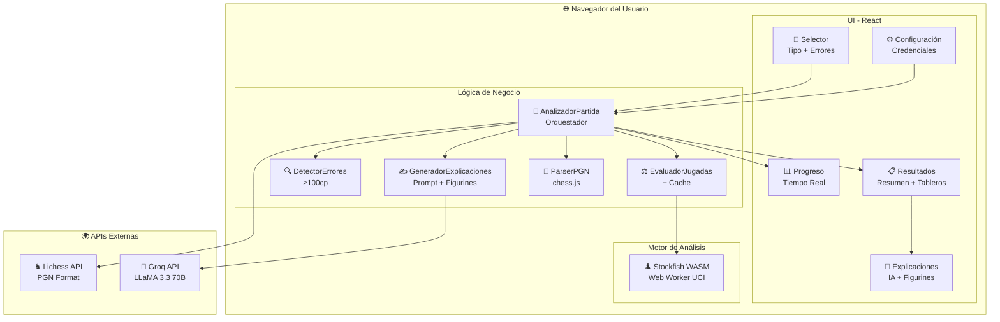
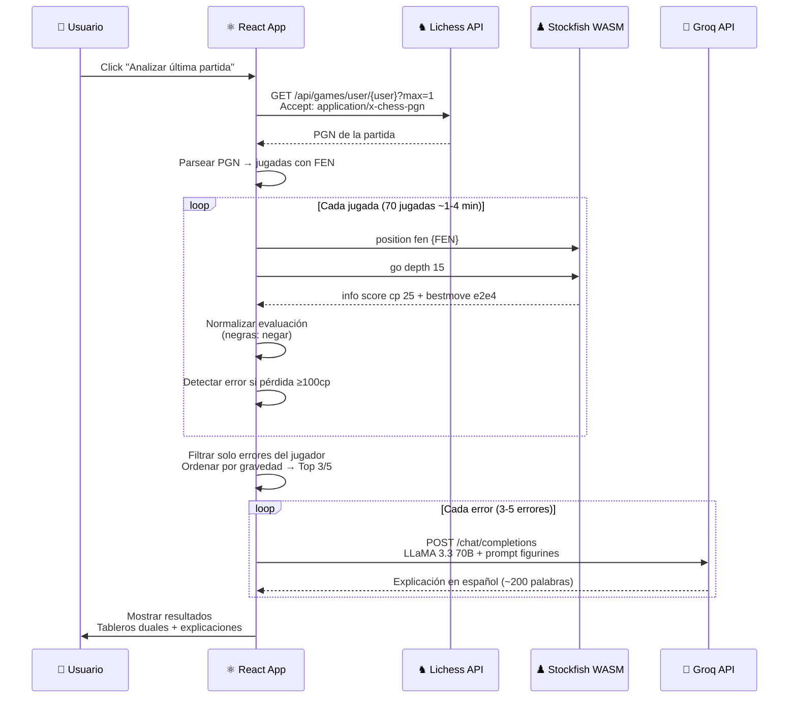
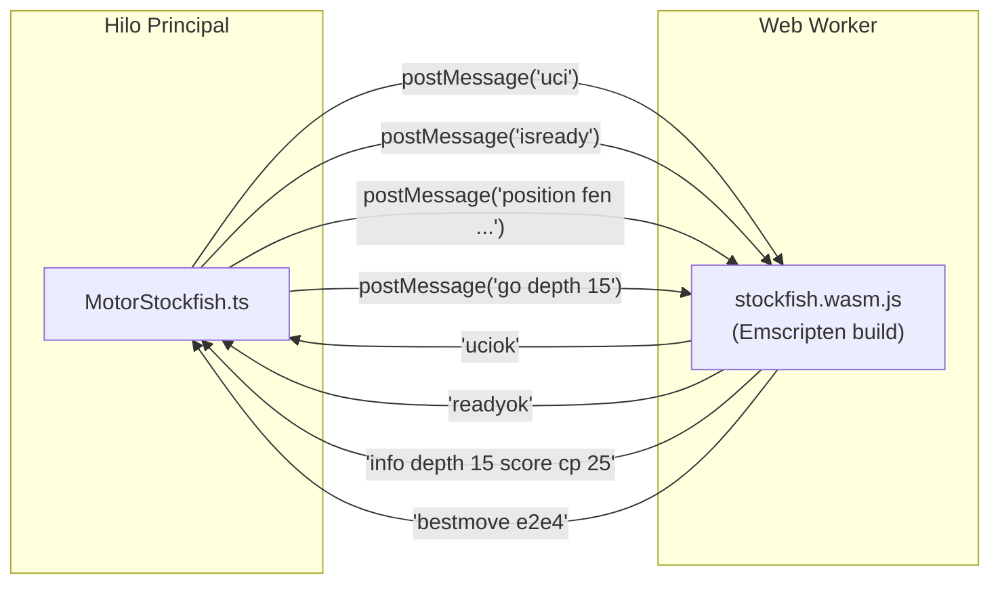
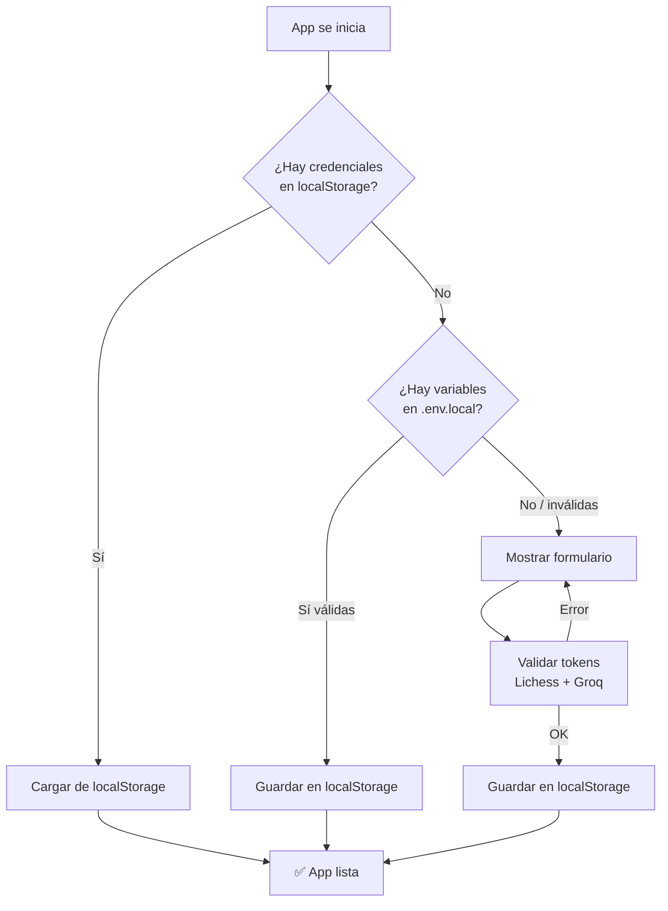

# ♟️ Ajedrez Trainer

Analizador de partidas de ajedrez que conecta con tu cuenta de Lichess, evalúa tus jugadas con Stockfish WASM y te explica los errores con IA (Groq/LLaMA 70B).

**Todo corre en el navegador** — no necesitás backend ni servidor propio.

---

## 🎯 ¿Qué hace?

1. Descarga tu última partida de Lichess (elegís el tipo: Bullet, Blitz, Rápida o Clásica)
2. Analiza CADA jugada con Stockfish (profundidad 15) corriendo en tu navegador
3. Detecta tus errores más graves (solo de TU color, no del oponente)
4. Te muestra los top 3 o 5 errores más costosos
5. Te explica cada error en castellano con IA (LLaMA 3.3 70B via Groq)
6. Muestra tableros duales: lo que hiciste vs lo que debías hacer

---

## 🚀 Instalación paso a paso

### 1. Clonar el repositorio

```bash
git clone https://github.com/tu-usuario/ajedrez-trainer.git
cd ajedrez-trainer
```

### 2. Instalar dependencias

```bash
npm install
```

### 3. Descargar Stockfish WASM

Necesitás los archivos de Stockfish compilados a WebAssembly.

Descargalos de: https://github.com/nicfab/stockfish.wasm/releases

Necesitás estos 2 archivos:
- `stockfish.wasm.js`
- `stockfish.wasm`

Copialos a la carpeta `public/stockfish/`:

```
public/
└── stockfish/
    ├── stockfish.wasm.js   ← Motor Stockfish compilado
    └── stockfish.wasm      ← Binario WebAssembly
```

### 4. Obtener credenciales

Necesitás **2 API keys gratuitas**:

#### 🔑 Token de Lichess

1. Andá a: **https://lichess.org/account/oauth/token**
2. Logueate con tu cuenta de Lichess
3. Creá un nuevo Personal API Token
4. **Permisos requeridos:** ✅ Read games (como mínimo)
5. Copiá el token — empieza con `lip_`

#### 🔑 API Key de Groq

1. Andá a: **https://console.groq.com/keys**
2. Registrate (es gratis, no pide tarjeta de crédito)
3. Creá una nueva API Key
4. Copiá la key — empieza con `gsk_`

### 5. Configurar credenciales

Tenés **dos opciones**:

#### Opción A: Desde la interfaz web (recomendada)

Arrancá la app con `npm run dev` y la primera pantalla te pide las credenciales. Se validan ambos tokens en tiempo real contra Lichess y Groq antes de guardar.

#### Opción B: Archivo `.env.local`

Creá un archivo `.env.local` en la raíz del proyecto:

```env
# ============================================
# CONFIGURACIÓN DE AJEDREZ TRAINER
# ============================================

# Lichess API Configuration
# Tu Personal API Token de Lichess
# Generalo en: https://lichess.org/account/oauth/token
# Permisos requeridos: Read games
VITE_LICHESS_USERNAME=tu_usuario_de_lichess
VITE_LICHESS_API_TOKEN=lip_tu_token_aqui

# Groq API Configuration
# Tu Groq API Key para explicaciones potenciadas por IA
# Generala en: https://console.groq.com/keys
VITE_GROQ_API_KEY=gsk_tu_api_key_aqui
```

> ⚠️ **Este archivo NO se sube a GitHub** (está en .gitignore). Las credenciales configuradas desde la web siempre tienen prioridad sobre el `.env.local`.

### 6. Arrancar la app

```bash
npm run dev
```

Abrí **http://localhost:5173** en tu navegador. ¡Listo!

---

## 🎮 Cómo usar

1. **Configurar** — La primera vez ingresá tu usuario, token de Lichess, y API key de Groq
2. **Elegir tipo de partida** — Bullet ⚡, Blitz 🔥, Rápida ⏱️, o Clásica ♟️
3. **Elegir cantidad de errores** — Top 3 (más rápido) o Top 5 (más detallado)
4. **Analizar** — Click en "Analizar última partida". Stockfish evalúa cada posición (~1-4 min según el largo)
5. **Revisar errores** — Navegá entre tus errores con tableros duales y explicaciones de IA
6. **Profundizar** — Cada error tiene un botón para generar una explicación aún más detallada

---

## 🛠️ Stack Tecnológico

| Tecnología | Uso |
|-----------|-----|
| **React 18** + TypeScript | Frontend |
| **Vite** | Build tool y dev server |
| **Stockfish WASM** | Motor de ajedrez (Web Worker, protocolo UCI) |
| **chess.js** | Lógica de ajedrez, validación, conversión UCI→SAN |
| **react-chessboard** | Visualización de tableros |
| **Groq API** (LLaMA 3.3 70B Versatile) | Explicaciones con IA |
| **Lichess API** | Descarga de partidas en formato PGN |
| **Vitest** | Tests unitarios e integración |

---

## 🏗️ Arquitectura

### Diagrama general del sistema



### Flujo de análisis



### Comunicación con Stockfish



### Gestión de credenciales



---

## 📁 Estructura del Proyecto

```
src/
├── components/          # Componentes React
│   ├── analisis/        # Selector de opciones de análisis
│   ├── configuracion/   # Formulario de credenciales (valida tokens)
│   ├── explicaciones/   # Panel de explicaciones IA + modal variante
│   ├── progreso/        # Barra de progreso en tiempo real
│   ├── resumen/         # Resumen de resultados + estadísticas
│   └── tablero/         # Tableros duales (error vs mejor jugada)
├── hooks/               # Hooks personalizados
│   ├── useAnalisis.ts   # Estado y control del análisis
│   ├── useCredenciales.ts # Gestión de credenciales (localStorage > .env.local)
│   └── useStockfish.ts  # Lazy loading del motor Stockfish
├── services/            # Lógica de negocio
│   ├── analisis/        # AnalizadorPartida, EvaluadorJugadas, DetectorErrores, GeneradorExplicaciones
│   ├── cache/           # Cache de evaluaciones Stockfish
│   ├── credenciales/    # GestorCredenciales (localStorage + Base64)
│   ├── groq/            # Cliente HTTP para Groq API
│   ├── lichess/         # Cliente HTTP para Lichess API
│   ├── parseo/          # Parser PGN → estructura de jugadas con FEN
│   └── stockfish/       # MotorStockfish (comunicación UCI directa con WASM worker)
├── types/               # Tipos TypeScript (Partida, Evaluación, ErrorDetectado, etc.)
└── utils/               # Logger, errores, notación figurine (♞♝♜♛♚)
```

---

## 🔧 Scripts disponibles

```bash
npm run dev       # Servidor de desarrollo (http://localhost:5173)
npm run build     # Build de producción
npm run preview   # Preview del build de producción
npm run test      # Ejecutar tests con Vitest
npm run lint      # Lint con ESLint
```

---

## 📝 Notas técnicas

- **Sin backend** — Todo corre en el browser. Stockfish WASM en un Web Worker, llamadas directas a Lichess y Groq.
- **Solo tus errores** — Detecta automáticamente con qué color jugaste y filtra solo tus errores.
- **Notación figurine** — Las piezas se muestran con símbolos Unicode (♞f3, ♝b5, ♛xd7+) como en Lichess.
- **Evaluación normalizada** — Internamente, positivo = ventaja blancas, negativo = ventaja negras.
- **UCI → SAN** — Stockfish devuelve movimientos en formato UCI (g1f1). Se convierten a SAN (♚f1) usando chess.js.
- **Rate limit Groq** — El plan free tiene límites por minuto. Si ves 429, esperá ~1 min. Las explicaciones fallidas usan un texto básico como fallback.
- **Tokens seguros** — Se guardan en localStorage (Base64). Solo se envían a Lichess y Groq directamente.

---

## 🐛 Problemas comunes

| Problema | Solución |
|----------|----------|
| "No tenés partidas de ese tipo" | Probá con otro formato (ej: Blitz en vez de Bullet) |
| Error 429 de Groq | Esperá 1 minuto, el rate limit se resetea solo |
| Stockfish tarda mucho | Normal en partidas largas (~1 min para 70 jugadas) |
| Token de Lichess inválido | Regenerá en https://lichess.org/account/oauth/token |
| La app no carga credenciales | Limpiá localStorage: DevTools > Application > Storage > Clear |
| "No hay credenciales configuradas" | Entrá a Configuración y guardalas de nuevo |

---

## 📄 Licencia

MIT
